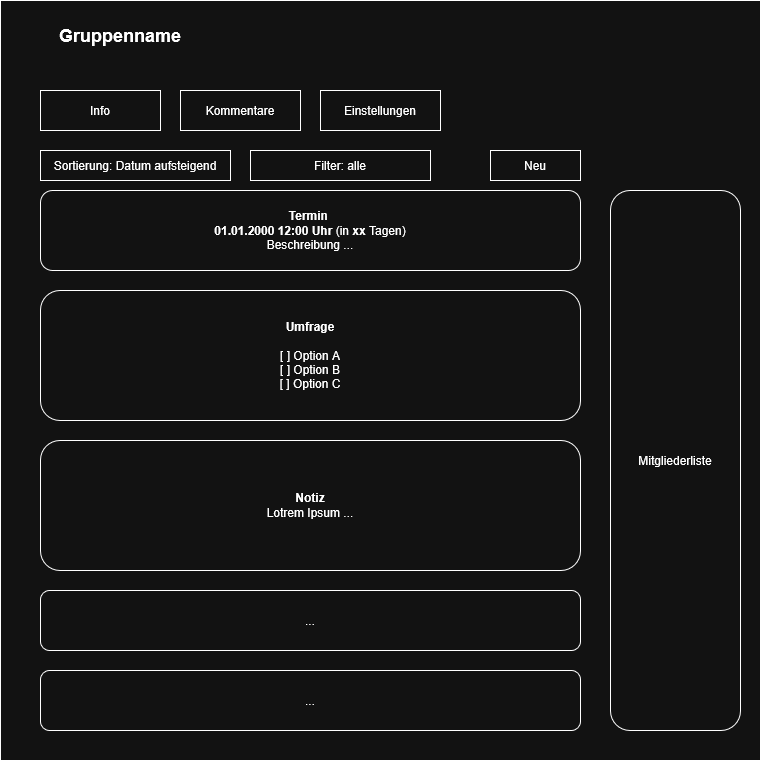
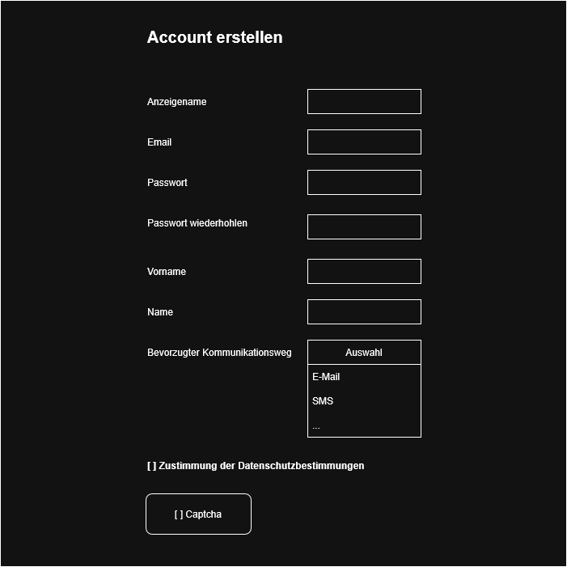
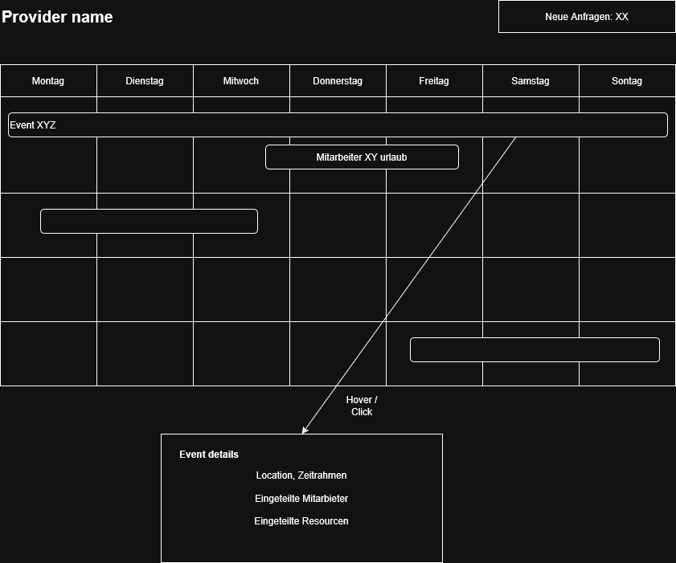
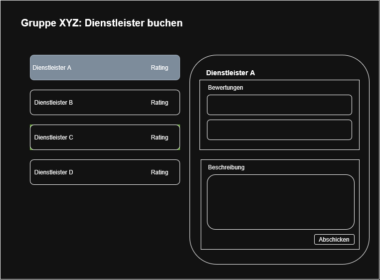
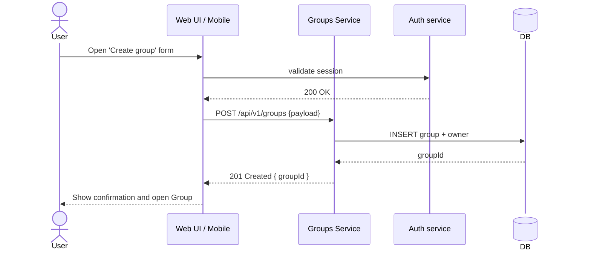
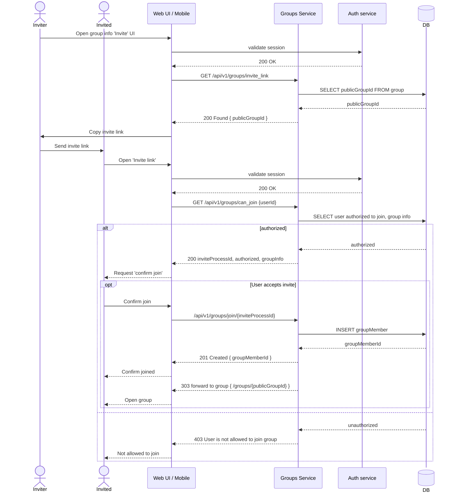
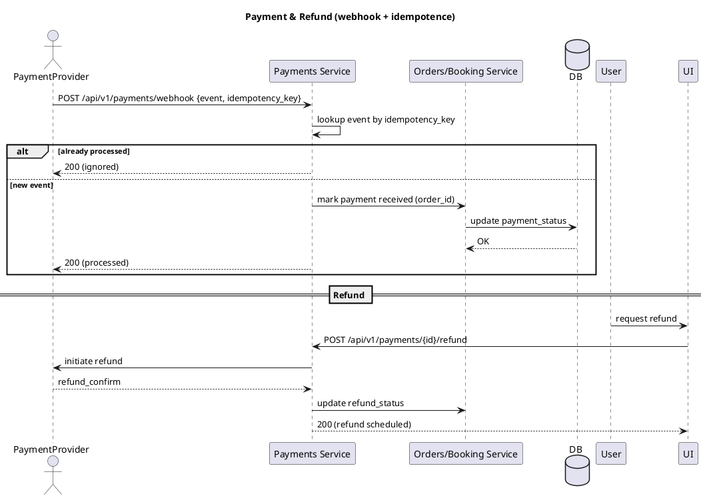

Software Spezifikation
======================

**Autor:** Colin Meihöfer
**Matrikelnummer:**  11143898

## Selbständigkeitserklärung

*Die Unterschrift findet sich in der beiligenden Datei: [Selbstständigkeitserklärung.pdf](Selbstständigkeitserklärung.pdf)*

Die Arbeit habe ich selbstständig erledigt. Als hilfsmittel habe ich den in VS-Code integrierten Copilot verwendet. Ich habe in verwendet um meine Ergebnisse zu Prüfen (eg. alle wichtigen Requirements gefunden) und nachzuarbeiten.


# 1 - Inhaltsverzeichnis

1. Titelblatt, Autoren, Selbstständigkeitserklärung
2. Zusammenfassung (Ziele, Scope, Annahmen)
3. Glossar / Domain‑Begriffe
4. Funktionale requirements (User‑Stories + zentrale Requirements‑Tabelle)
  - 4.1 User Stories
  - 4.2 Funktionale Anforderungen
5. 4+1 Sichten
  - 5.1 Use‑case / Szenarien
  - 5.2 Logische übersicht
  - 5.3 Entwicklerübersicht
  - 5.4 Prozessübersicht
  - 5.5 Physische übersicht
6. Nicht‑funktionale Anforderungen
7. Security & Privacy


# 2 - Zusammenfassung

Kurzfassung (Executive Summary)

Dieses Dokument beschreibt die Spezifikation für eine Plattform zur Planung, Organisation und Durchführung von Gruppen‑Events (z. B. Reisen, Vereins‑ oder Firmenveranstaltungen). Kernnutzen: Teilnehmer können Gruppen anlegen/verwalten, Termine/Umfragen/Finanzen koordinieren und externe Dienstleister (z. B. Veranstaltungstechnik) buchen. Die Lösung adressiert sowohl Privatnutzer als auch kommerzielle Dienstleister und bietet ein Provider‑Portal, Zahlungs‑ und Rechnungsfunktionen sowie Compliance‑ und Betriebsmechanismen (Monitoring, Backups, DSGVO‑Workflows).

Zielsetzung: Eine sichere, skalierbare Web‑ und Mobile‑Plattform, die Gruppen‑Organisation, Zahlungsabwicklung und Dienstleister‑Management in einem integrierten Workflow unterstützt.

Wichtige Kennzahlen. Da diese nicht weiter spezifiziert wurden, wird von üblichen Kennzahlen ausgegangen
- Verfügbarkeit (SLA target): 99.5% (kritische Dienste: auth, payments, groups). 
- Performance: Group‑listing — median < 150 ms, 95th‑percentile < 500 ms.
- Durchsatz: skalierbar auf ~10k gleichzeitige aktive Nutzer pro Region (horizontale Skalierung).
- Backup: 
  + tägliche Backups (RPO = 24 h); 
  + RTO kritisch (auth/payments) < 1 h, 
  + RTO nicht‑kritisch < 24 h.
- Datenschutz: Lösch‑Workflow abgeschlossen / Anonymisierung innerhalb 30 Tagen; Datenexport innerhalb 7 Tagen.

Scope (konkret)
- In Scope (MVP): User‑Management (Auth, Sessions, 2FA optional), Gruppen (Erstellen, Beitreten, Rollen), Notizen/Termine/Umfragen, Einzahlungen & einfache Abrechnung, Provider‑Listing + Buchung, Basis UI (Web + responsive Mobile), Audit & DSGVO‑Flows.
- Out of Scope (MVP): vollständiges End‑to‑End E2E‑Verschlüsselung, komplexe Market‑Place‑Features (Gebotsauktionen), Enterprise‑SAML (optional später), vollständige Offline‑Mobile‑Funktionalität.

Priorisierte Annahmen
- Nutzerdaten und Transaktionen sind primär in einer zentralen Region gespeichert; system ist regional skalierbar.
- Zahlungen werden über einen externen Provider (Stripe/Adyen) angebunden — Zahlungs‑Reconciliation via API.
- Externe Kalender‑Sync (Google/Outlook/iCal) wird als Integrationsfeature implementiert; initial nur Pull/Sync‑Opt‑in.

Top‑Risiken (priorisiert)
1. Business/Integration: Unklare Payment‑Provider‑Entscheidung verzögert MVP (Mitigation: Auswahl‑kriterien + PoC innerhalb 2 Wochen).
2. Datenschutz: Lösch‑/Export‑Workflow komplex (Mitigation: API‑Contract + automatisierte Tests für Delete/Anonymize).
3. Security: Unzureichende Auth/Session‑Hardening → Account‑Kompromittierung (Mitigation: starke PW‑Policy, 2FA, WAF, regelmäßige Pen‑Tests).
4. Operational: Fehlen von Runbooks/Monitoring führt zu langen Ausfallzeiten (Mitigation: Runbook + SLOs vor Produktionsstart).

Akzeptanzkriterien für die Deliverables (Kurz)
- MVP accepted when: alle "Muss"‑Stories in Kapitel 4 implementiert und durch End‑to‑End‑Tests verifiziert sind; kritische SLOs (auth/payments/group‑listing) werden in Staging‑Loadtests erreicht; DSGVO‑Delete/Export‑Flows getestet.

Empfohlene nächste Schritte (priorisiert)
1. Entscheidung: Payment‑Provider (PoC → 1 chosen) — blocker für Invoicing/Refunds.  
2. Erzeuge Traceability‑Matrix (Requirement → Use‑case → API → Test).  
3. Erstelle Runbook‑Draft für Top‑3 Incidents (auth outage, payment failure, data‑loss).

Akzeptanz der Zusammenfassung
- Diese Zusammenfassung ist akzeptabel, wenn sie in Review von Product Owner bestätigt wird und die drei NFR‑Defaults (SLA, latency, RTO) als Ausgangswerte genehmigt werden.


# 3 - Glossar 

<!--
- Glossar
  - Liste der Domainbegriffe + kurze Definitionen (z. B. Group, Event, Organizer, Provider)
-->

| Name          | Beschreibung  |
| ------------- | ------------- |
| Gruppe        | Eine Sammlung an Nutzern die sich über eine Gruppe austauschen können |
| Benutzer      | Ein Nutzer von unserem Service |
| Dienstleister | Ein Externer Dienstleister der auf unser Platform vertreten ist und von Gruppen beauftragt werden können |
| System        | Stellvertreten für uns als Service oder Serviceanbieter |
| Owner         | Der Benutzer, der eine Gruppe erstellt hat |
| Admin         | Ein Gruppenmitglied mit erhöhten rechten innerhalb einer Gruppe |


# 4 - Funktionale requirements

## 1.4 Schnittstellen & Systemarchitektur

**Kurzbeschreibung**

Die Plattform ist als cloud‑native, dreischichtige Web‑/Mobile‑Anwendung ausgelegt: klientenseitig (Web / Mobile), API‑Layer (Gateway / Edge) und ein Backend‑Service‑Ökosystem (auth, groups, payments, provider, media, notifications, background workers). Persistente Daten liegen in einer relationalen Primärdatenbank; große Binärdaten (Fotos/Videos) werden in Object Storage abgelegt. Caching, Message‑Broker und Suchindex sind zusätzliche Komponenten zur Skalierung.

**Hauptkomponenten (Übersicht)**
- API Gateway / Ingress: TLS‑Termination, Routing, Rate‑Limiting, Authn/Z
- Auth Service: Login, Sessions, 2FA, Token‑Issuance, Account Management
- Groups Service: Domain‑Logik für Gruppen, Mitglieder, Notizen, Termine, Surveys
- Payments Bridge: Integration zu Stripe/Adyen, Webhook‑Handler (idempotent)
- Provider / Marketplace Service: Provider‑Listing, Angebote, Buchungen, Ressourcenplanung
- Media Service / Object Storage: Uploads, Thumbnails, CDN‑Serving
- Background Workers: E‑Mails, Push, Reconciliations, Refunds, Maintenance Jobs
- Data Stores: Primary RDBMS (ACID), Redis (cache, sessions, rate limits), Search (Elasticsearch/Opensearch)
- Message Broker: RabbitMQ / Kafka für asynchrone Aufgaben und Events
- Observability: Prometheus, Grafana, ELK/Opensearch, Tracing (Jaeger)
- CI/CD, IaC, KMS/Secrets Manager

**Hoch‑level Daten‑/Control‑Flow**
Client (Web/Mobile) --HTTPS--> API Gateway --Auth--> Backend Service (REST/gRPC) --> RDBMS / Cache / Broker. Asynchrone Aufgaben werden über den Broker an Worker delegiert; Webhooks und externe Integrationen (Payments, Calendar, Email/SMS) laufen über dedizierte adapters mit Idempotenz‑Handling.

## 4.1 — User stories

### Gruppenübersicht

Ein Nutzer möchte eine Gruppe auswählen und dann eine Übersicht über die Gruppe bekommen. Er möchte wissen, welche Mitglieder der Gruppe angehören und welche Termine als nächstes anstehen anstehen. Er möchte in der Lage sein, die Übersicht über die Informationen in einer, für ihn relevanten, Reihenfolge zu sortieren und zu filtern. Außerdem möchte er Zugriff auf die anderen Aspekte der Gruppe haben. Wie zum Beispiel Kommentare und Einstellungen




### Nutzer registrieren
Ein Nutzer möchte sich auf unserer Platform Registrieren. Dazu muss er alle Daten eingeben, die wir benötigen, damit wir ihm unseren Service anbieten können. Der Nutzer möchte einen eigen Nutzernahmen angeben, unter dem er auf der Platform angezeigt wird. Er will ein Passwort vergebene, so dass sein Account vor Fremdzugriffen geschützt ist und er möchte seine Präferierte Kontaktmöglichkeit angeben. Außerdem benötigen wir seine E-Mail, um ihn kontaktieren zu können. Zum Beispiel um das Password zurück zu setzen.




### Dienstleister übersicht
Ein Dienstleister benötigt eine Zeitliche übersicht über alle Events die er Organisieren soll und welche Mitarbeiter wann blockiert sind, damit er die Mitarbeiterzuweisungen planen kann. Außerdem möchte er sehen, ob er neue Anfragen erhalten hat.




### Dienstleister auswählen
Eine Gruppe möchte über das Portal einen Dienstleiter Beauftragen das Event zu organisieren. Dazu soll ein Gruppenmitglied eine Liste möglicher Dienstleister angezeigt bekommen. Der Nutzer möchte dabei die Bewertungen des Dienstleister sehen. Hat er einen Dienstleister Ausgewählt möchte er eine genauere Beschreibung des Dienstleisters und detaillierte Bewertungen vorheriger Leistungsnehmer sehen. Um den Dienstleister zu beauftragen möchte er eine Beschreibung verfassen, um dem Dienstleister zu beschreiben was von ihm erwartet wird.




## 4.2 — Funktionale Anforderungen
<!--
- Functional requirements (canonical)
  - Vollständige User‑Stories‑Tabelle (canonical source)
  - Priorisierung (MoSCoW), Acceptance‑Criteria, einfache Akzeptanztests
  - Traceability‑IDs (UIDs) für jede Story
-->

| Name/ID | In meiner Rolle als ... | möchte ich ...                  | , so dass...           | Akzeptiert, wenn...       | Priorität |
| ----------------- | ----------- | --------------------------------- | ---------------------- | ------------------------- | ---- |
| user anmelden     | Benutzer    | mich bei dem Service Anmelden     | ich mich anmelden kann | User können sich anmelden | Muss |
| user registrieren | Benutzer    | mich bei dem Service registrieren | ich mich registrieren kann | User können sich registrieren | Muss |
| user username     | Benutzer    | einen benutzernahmen angeben      | dieser für mich angezeigt wird | User kann username eingeben | Kann |
| user name         | Benutzer    | Meinen legalen Namen angeben können | Rechnungen Automatisch erstellt werden können | der User seinen Namen angeben kann | Kann |
| user email        | Benutzer    | eine E-Mail angeben               | ich benachrichtigt werden kann | User kann E-Mail eingeben | Kann |
| user communication | Benutzer   | meinen bevorzugten Kommunikationsweg angeben | ich über diesen Weg wichtige Benachrichtigungen erhalten kann | der User seinen bevorzugten Kommunikationsweg angeben kann | Kann |
| user password (double) | Benutzer | ein Password angeben (zweimal)  | Schreibfehler werden vermieden | Passwort muss zweimal eingegeben werden; Mindeststärke geprüft (z.B. 8+ Zeichen, Zahl, Sonderzeichen) | Muss |
| password hash     | System      | dass mein Password gehasht und gesaltet wird | Passwörter nicht im Klartext gespeichert werden | Passwörter mit einem modernen KDF (z. B. Argon2/bcrypt) + Salt gespeichert | Muss |
| password reset    | Benutzer    | mein Passwort zurücksetzen können | ich wieder Zugriff erhalte | Reset per E‑Mail mit einmaligem Token (gültig 1 h); nach Reset erfolgt Benachrichtigung an alle aktiven Sessions | Muss |
| session & logout  | Benutzer / System | aktiv angemeldete Sessions verwalten (Logout, Session‑Timeout, Revoke) | Konten sicher bleiben, auch bei Geräteverlust | Benutzer können sich abmelden; Sessions verfallen automatisch (configurierbar); Admin kann Sessions widerrufen | Muss |
| register captcha   | System      | dass der User bei der Registrierung ein Captcha lösen muss | sich Bots nicht so einfach registrieren können | Registrierung kann optional ein Captcha verlangen (konfigurierbar) | Soll |
| E‑Mail verification | System    | dass der User bei der Registrierung seine E‑Mail überprüfen muss | E‑Mail‑Besitz ist verifiziert | Verifikationslink (24 h Gültigkeit); Konto eingeschränkt bis zur Verifikation | Muss |
| user page after login | Benutzer    | nach dem login auf eine Seite mit einer übersicht über Gruppen kommen | ich auf Anhieb eine Übersicht über meine Gruppen habe | wenn die user homepage die Gruppenübersicht ist | Muss |
| Gruppenübersicht      | Benutzer | eine übersicht über Mein, Beigetretenen und Öffentliche Gruppen haben | ich eine Übersicht über die für mich interessanten Gruppen habe | der User eine Übersicht über die Gruppen, denen er beigetreten, die er erstellt und die für ihn interessant sind, hat | Muss |
| Gruppenübersicht sortieren | Benutzer | die Liste der verfügbaren Gruppen sortieren | mir Gruppen entsprechend meines aktuellen Interesses angezeigt werden | der User die angezeigte Liste an Gruppen sortieren kann | Kann |
| Gruppenübersicht navigieren | Benutzer | durch anwählen zu der angewählten Gruppe gelangen | ich mit der Angewählten Gruppe interagieren kann | der User durch anwählen zu einer Gruppe Navigieren kann | Muss |
| Gruppe erstellen      | Benutzer | eine neue Gruppe erstellen können | eine Gruppe mit Start‑/Enddatum anlegen | Pflichtfelder: Name, Sichtbarkeit (öffentlich/privat/hidden); Ersteller = Owner; Erzeugung liefert feste Event‑URL und Join‑Code | Muss |
| Gruppe löschen (Owner) | Owner | eine selbst erstellte Gruppe löschen können | die Daten nicht mehr für Teilnehmer sichtbar sind | Nur Owner kann löschen; Lösch‑Workflow zeigt Folgen (Archivieren vs. vollständiges Löschen) und erfordert Bestätigung | Muss |
| Gruppe beitreten      | Benutzer | einer bestehenden Gruppe beitreten können | ich Teilnehmer der Gruppe werde | Beitritt per Join‑Code / Einladungs‑Link oder öffentliche Gruppe; Beitritt erscheint sofort in Mitgliederliste | Muss |
| Gruppenmitglieder     | Gruppenmitglied | sehen, wer sonst noch in der Gruppe ist | ich weiß, wer teilnimmt | Mitgliederliste mit Rollen (Owner, Admin, Member); Datenschutz: nur für berechtigte Nutzer sichtbar | Muss |
| Invite‑Code verwalten | Owner / Admin | Join‑Codes erzeugen, Ablaufdatum setzen und widerrufen | nur berechtigte Personen beitreten können | Codes haben optionales Ablaufdatum; Owner kann Codes sofort invalidieren | Muss |
| Gruppeneinladung link | Benutzer | einer Gruppe über einen festen Link beitreten können | einfache Einladung möglich ist | Einladungs‑Link ist stabil oder hat konfigurierbares Ablaufdatum; Nutzung protokolliert | Muss |
| Gruppeneinladung qr   | Benutzer | einer Gruppe über einen QR‑Code beitreten können | einfacher Beitritt via Mobilgerät | QR codiert die Event‑URL/Join‑Code; Ablaufregel wie bei Link | Kann |
| Gruppenbeschreibung setzen    | Gruppenmitglied | eine Gruppenbeschreibung setzen | klarer Kontext für die Gruppe | Beschreibung editierbar; Änderungen protokolliert; nur berechtigte Rollen dürfen großflächig bearbeiten | Kann |
| Gruppe verlassen              | Gruppenmitglied | eine Gruppe verlassen können | ich erhalte keine weiteren Benachrichtigungen | Mitglieder können selbstständig austreten; Einzahlungen werden gemäß Regeln behandelt (siehe Einzahlungs‑Policy) | Muss |
| Gruppe Mindestteilnehmer      | Owner / Admin | eine Mindestteilnehmerzahl festlegen | Event findet nur ab Mindestanzahl statt | Mindestanzahl wird angezeigt; bei Unterschreitung Benachrichtigung an Owner | Muss |
| Gruppe Mindestbetrag (vereint) | Owner / Admin | einen Mindestbeitrag für das Event festlegen | Finanzierungssicherheit des Events | Mindestbetrag sichtbar auf Event‑Homepage; System meldet "erreicht"/"offen"; automatische Aktionen (z. B. Cancel/Refund) konfigurierbar | Muss |
| Gruppe max. Einzahlung (optional) | Gruppenmitglied | optional ein System‑Limits setzen/anzeigen | Missbrauch oder Fehler vermeiden | System kann ein optionales Oberlimit pro Zahlung konfigurieren; wenn nicht gesetzt, gilt "kein Limit" | Kann |
| Gruppe Einzahlungsübersicht   | Gruppenmitglied | Übersicht über alle eingegangenen Zahlungen | ich sehe wer wie viel bezahlt hat | Tabelle mit Beträgen, Datum, Zahler; Summen und ausstehender Betrag; Export (CSV/JSON) möglich | Muss |
| Gruppe Kassensturz | Gruppenmitglied | eine Übersicht über alle Ausgaben der Gruppe habe | ich diese den Einzahlungen gegenüber stellen kann | Gruppenmitglieder eine Übersicht über die Ausgaben einer Gruppe haben | Muss | 
| Gruppe Info-Übersicht         | Gruppenmitglied | eine Chronologische übersicht über alle Notizen, Termine und Umfragen | neue Infos auf den ersten Blick erkenne | Gruppenmitglieder eine chronologische Übersicht über die Gruppeninformationen haben | Muss |
| Gruppe Info-Übersicht sortieren | Gruppenmitglied | die Angezeigten Infos sortieren können | die für mich relevanten Infos an erste stelle stehen | Gruppenmitglieder können die angezeigten Infos sortieren | Kann |
| Gruppe Notizen                | Gruppenmitglied | der Gruppe eine neue Notiz hinzufügen | ich Infos und Erlebnisse mit den anderen Gruppenmitgliedern teilen kann | Gruppenmitglieder neue Notizen hinzu fügen können | Muss |
| Gruppen Termine               | Gruppenmitglied | der Gruppe ein neues Datum als Termin hinzufügen können | ich wichtige Termine mit den anderen Gruppenmitgliedern Teilen kann | Gruppenmitglieder einer Gruppe Termine hinzufügen können | Muss | 
| Gruppenumfragen               | Gruppenmitglied | der Gruppe eine Umfrage hinzufügen können | ich die Präferenzen der anderen Gruppenmitglieder erfragen kann | Gruppenmitglieder Umfragen erstellen können | Kann |
| Umfrage type | Gruppenmitglied | Umfragen mit verschiedene Typen erstellen | ich Gruppenmitgliedern Single und Multiple choice fragen stellen | Gruppenmitglieder bei der Erstellung von Umfragen die Wahl zwischen Single und Multiple choice Aufgaben haben | Muss |
| Zufriedenheit‑Umfrage         | Gruppenersteller | nach dem Event / Urlaub eine Zufriedenheitsumfrage erstellen | ich weiß, wie zufrieden die Gruppenmitglieder mit der Planung / Durchführung des Events waren | Gruppenersteller nach einem Event eine Zufriedenheitsumfrage an die Gruppenmitglieder senden können | Kann |
| Gruppendokumentation (Media)  | Gruppenmitglied | Kommentare, Bilder und Videos hochladen | Event dokumentieren | Upload erlaubt (Whitelist‑MIME), Max‑Größe konfigurierbar, Moderations‑Flag | Kann |
| Gruppen‑Lifecycle (state machine) | Owner / System | Eventzustände (Draft→Open→Confirmed→Cancelled→Archived) verwalten | automatisierbare Abläufe möglich | Zustandsübergänge definiert; bei Cancel automatischer Refund‑Pfad / Benachrichtigung möglich | Muss |
| Zahlungs‑Webhook Idempotenz   | System      | eingehende Payment‑Events idempotent verarbeiten | keine Doppelbuchungen entstehen | Webhook‑Events mit Idempotency‑Key; wiederholte Zustellungen erzeugen kein Duplikat | Muss |
| Gruppen‑Zeitraum              | Gruppenmitglied | einen Zeitpunkt / Zeitraum festlegen | ich kommuniziere, wann das Event stattfindet | Start/End‑Datum vorhanden; Zeitzone angegeben; wiederkehrende Termine optional | Muss |
| Gruppen: Aufgaben (create) | Gruppenmitglied | Aufgaben erstellen | Team-Aufgaben verwaltbar sind | Neue Aufgabe wird in Gruppen-Task‑Liste angezeigt; Pflichtfelder: Titel, Fälligkeitsdatum; API-Response 201 | Muss |
| Gruppen: Aufgabe zuweisen | Gruppenmitglied | Aufgaben einem Mitglied zuweisen | Zuständigkeiten klar sind | Zuweisung ändert Task-Status; Benachrichtigung an Empfänger innerhalb 5 min | Muss |
| Gruppen: Aufgabe abschließen | Gruppenmitglied | Aufgabe als erledigt markieren | Aufgabenstatus aktuell ist | Statuswechsel sichtbar für alle Mitglieder; Änderungs-Log vorhanden | Muss |
| Aufgaben: Erinnerungen (configurable) | Gruppenmitglied | Erinnerungen per bevorzugtem Kanal erhalten | Deadlines nicht verpasst werden | Erinnerung per E‑Mail/Push/SMS laut Präferenz; konfigurierbar; Zustellung innerhalb 5 min vor Fälligkeit (configurable) | Kann |
| Rollen & Rechte (RBAC Basis) | Gruppen-Owner | Rollen (Owner/Admin/Member) vergeben | Zugriff und Aktionen steuerbar sind | Owner kann Rollen ändern; Berechtigungen enforced (z. B. nur Owner kann Gruppe löschen) | Muss |
| Owner auto‑assignment | Gruppenersteller | nach Erstellung Owner sein | Einstellungen verwalten zu können | Ersteller ist Owner; Owner-Flag in DB gesetzt | Muss |
| Mitgliederverwaltung | Gruppen-Admin | Mitglieder entfernen / einladen | Moderation möglich ist | Admin kann Mitglied entfernen; Aktion audit‑logged; entfernte Nutzer verlieren Zugriff sofort | Muss |
| Editions: Community / Premium | User | freie / kostenpflichtige Pläne nutzen | Produkt‑Limits durchsetzen | Community: ≤3 aktive Gruppen; Premium: keine Limit; Abrechnung aktiviert für Premium | Muss |
| Multi‑device parity | User | gleiches Funktionsset auf allen Geräten | konsistente UX | Kernfunktionen auf Mobile/Web verfügbar; responsives Layout (breakpoints) | Muss |
| Dienstleister: Listing & Angebot | Dienstleister | Dienstleistung einstellen & Angebot erstellen | Veranstalter finden passende Anbieter | Listing mit Pflichtfeldern; Angebot enthält Preise (Netto/Brutto), Positionen, Fotos; Download als PDF möglich | Muss |
| Dienstleister: Buchung & Budget | Gruppenmitglied | Dienstleister buchen; Budget setzen | Planung & Kostenkontrolle möglich | Buchung erzeugt Reservierung; Budget‑Limit verhindert Überbuchung; Bestätigung & Storno‑API vorhanden | Muss |
| Dienstleister: Ressourcen & Mitarbeiter | Dienstleister | Material & Personal verwalten | Verfügbarkeit planbar ist | Ressourcen können geblockt/entblockt werden; Mitarbeiter‑Calendar sichtbar; Konflikte verhindert | Muss |
| Bewertungen & Feedback | Gruppenmitglied | Dienstleister bewerten | Qualität transparent wird | Bewertung nur nach abgeschlossenem Event; Anzeige mittelt Bewertungen; Missbrauchs-Moderation möglich | Kann |
| Material‑Lifecycle (Wartung) | Dienstleister | Wartungszyklen verwalten | Ausfälle planbar sind | Wartungs‑Reminder configurable; Historie pro Asset vorhanden | Muss |
| Abrechnung: Rechnung + Mahnwesen | Dienstleister / Organisator | Rechnungen automatisch erzeugen / Mahnungen senden | Zahlungen eingetrieben werden | Rechnung generiert aus Angebot; PDF/CSV-Export; Mahnung nach konfigurierbarer Frist (z. B. 30 Tage) | Muss |
| DSGVO – Datenexport & Löschung | Benutzer | meine Daten exportieren/ löschen lassen | Recht auf Auskunft / Vergessenwerden erfüllt ist | User kann vollständigen Datenexport (JSON/CSV) anfordern; Löschung führt zu Anonymisierung/Entfernung innerhalb 30 Tage; Audit-Log der Anfrage | Muss |
| Sicherheit: Auth & Sessions | Benutzer/System | 2‑Faktor, Session‑Timeout, Account‑Lockout | Konten sicher sind | Passwort-Hashing mit Argon2/bcrypt; 2FA optional; Session default 30 min idle; Account lock after 5 failed attempts (configurable) | Muss |
| Payments: Webhook Idempotenz & Refunds | System | sichere Zahlungsabwicklung | keine Doppelbuchungen; Rückerstattungen möglich | Webhooks idempotent; Refunds via API in <72 h; reconciliations reportierbar | Muss |
| Observability & Ops | Betreiber | Monitoring, Logging, Backups | Betriebssicherheit gewährleistet | 99.5% availability target (SLA); zentrale Logs (retention 90d); tägliche Backups; Alerts bei Fehlern | Soll |
| API: Contract & Rate Limits | Integrator | stabile API nutzen | Integration zuverlässig bleibt | OpenAPI spec vorhanden; 95th pct response <500ms; rate limit 1000 req/min per API key | Soll |
| Accessibility (WCAG) | User | barrierefreien Zugang haben | inklusiver Betrieb | WCAG 2.1 AA für Kern-User‑Flows | Soll |
| Testing & CI/CD | Entwickler | automatisierte Qualitätssicherung | Regressionen verhindert werden | Unit/Integration/E2E in CI; PRs müssen CI grünes Licht haben | Muss |

<!--
### Ergänzende nicht‑funktionale Anforderungen (Auswahl / messbar)
- Performance: 95th‑percentile API latency < 500 ms für Kernendpunkte (list/create/join).
- Skalierbarkeit: System skaliert horizontal bei 50% CPU‑Auslastung der Instanzgruppe.
- Sicherheit: TLS 1.2+ enforced; Secrets in KMS; regelmäßige Pen‑Tests (Jährlich).
- Datenschutz: Datenexport (JSON/CSV), Lösch‑Workflow, Einwilligungs‑Logging für E‑Mails.
-->

# 5. 4+1 Sichten

## 5.1 Use‑case / Szenarien
<!--
- Use‑case / Szenarien
  - Use‑case‑Diagramm (Actors + top 10 Use‑cases)
  - 3–5 Sequenzdiagramme (z. B. Create Group, Book Provider, Payment + Refund)
  - Mapping Story→Use‑case
-->

### Gruppe erstellen
A user sends a request to create a new group. His session is validated and on successful validation the group is created. After the group is created the user can be redirected to the groups page.





#### Gruppendaten
```
{
  name : Provided by user
  groupId" : Automatically generated unique id
  visibility : Provided by user (default Private)
}
```


### Gruppe über link beitreten
An exiting group member can access an invite link through the UI. This invite link can be send to other users. 
If another user opens that invite link, the join process is stared. First it is validated if the user is allowed to join the group (ie: not blocked, etc.). If the user is allowed to join the User is displayed basic information about the Group so that he can ensure that he is joining the group he is intending to. If the user confirms, the user is added as a group member. The user the receives confirmation of the successful join and is redirected to the groups page.
If the user is already part of the group he can be redirected to the groups page directly.




### Einzahlung rückerstatten

Ein Nutzer kann nicht mehr an einem Event Teilnehmen. Zum Beispiel weil er Krank geworden ist. Daher möchte der Nutzer die Einzahlung, welche er gemacht hat, um an dem Event Teilnehmen zu können, zurückerstattet bekommen.





## 5.2 Logische Übersicht (Logical view)
<!--
- Logical View
  - Domänen‑Klassendiagramm (Entitäten + Schlüsselattribute)
  - ER‑Diagram + CRUD‑Matrix
  - Daten‑Retention & Privacy per Entität
-->

**Ziel:** Darstellung der logischen Strukturen

### ER - Model


<!--
different diagram layout
---
title: Order example
config:
    layout: elk
---
-->


### CRUD-Matrix

Die CRUD-Matrix zeigt für jede Entität im ER-Modell die unterstützten Operationen (Create, Read, Update, Delete), basierend auf den funktionalen User Stories und der API-Spezifikation. "Ja" bedeutet, die Operation ist verfügbar; "Nein" bedeutet, sie ist nicht vorgesehen oder nicht erforderlich.

| Entität                  | Create | Read | Update | Delete | Begründung / Einschränkungen |
|--------------------------|--------|------|--------|--------|------------------------------|
| USER                     | Ja     | Ja   | Ja     | Ja     | Registrierung (Create), Profil-Update (Update), DSGVO-Löschung (Delete), Profil-Anzeige (Read). |
| GROUP                    | Ja     | Ja   | Ja     | Ja     | Gruppen erstellen/beitreten (Create), Übersicht (Read), Bearbeiten (Update), Löschen (Delete). |
| GROUP_MEMBER             | Ja     | Ja   | Ja     | Ja     | Beitritt (Create), Mitgliederliste (Read), Rollen ändern (Update), Entfernen (Delete). |
| TRANSACTION              | Ja     | Ja   | Nein   | Nein   | Einzahlungen (Create), Finanzübersicht (Read); Rückerstattungen via spezielle API (nicht direkt Update/Delete). |
| GROUP_NOTE               | Ja     | Ja   | Ja     | Ja     | Notizen hinzufügen (Create), Anzeigen (Read), Bearbeiten (Update), Löschen (Delete). |
| GROUP_APPOINTMENT        | Ja     | Ja   | Ja     | Ja     | Termine erstellen (Create), Anzeigen (Read), Bearbeiten (Update), Löschen (Delete). |
| GROUP_SURVEY             | Ja     | Ja   | Ja     | Ja     | Umfragen erstellen (Create), Anzeigen (Read), Bearbeiten (Update), Löschen (Delete). |
| GROUP_SURVEY_QUESTION    | Ja     | Ja   | Ja     | Ja     | Fragen als Teil der Umfrage (CRUD über Survey-API). |
| GROUP_SURVEY_ANSWER      | Ja     | Ja   | Nein   | Nein   | Antworten abgeben (Create), Ergebnisse anzeigen (Read); keine Änderung/Löschung nach Abgabe. |
| GROUP_COMMENT            | Ja     | Ja   | Ja     | Ja     | Kommentare/Media hochladen (Create), Anzeigen (Read), Bearbeiten (Update), Löschen (Delete). |
| GROUP_TASK               | Ja     | Ja   | Ja     | Ja     | Aufgaben erstellen (Create), Anzeigen (Read), Zuweisen/Abschließen (Update), Löschen (Delete). |
| SERVICE_PROVIDER         | Ja     | Ja   | Ja     | Ja     | Provider registrieren (Create), Listing (Read), Bearbeiten (Update), Löschen (Delete). |
| SP_EMPLOYEE              | Ja     | Ja   | Ja     | Ja     | Mitarbeiter hinzufügen (Create), Anzeigen (Read), Bearbeiten (Update), Entfernen (Delete). |
| SP_EMPLOYEE_APPOINTMENT  | Ja     | Ja   | Ja     | Ja     | Termine planen (Create), Kalender anzeigen (Read), Ändern (Update), Stornieren (Delete). |
| SP_RESOURCE              | Ja     | Ja   | Ja     | Ja     | Ressourcen hinzufügen (Create), Anzeigen (Read), Bearbeiten (Update), Entfernen (Delete). |
| SP_RESOURCE_RENT         | Ja     | Ja   | Ja     | Ja     | Verleihhistorie (Create via Buchung), Anzeigen (Read), Ändern (Update), Löschen (Delete). |
| SP_GROUP_EVENT           | Ja     | Ja   | Ja     | Ja     | Events anlegen (Create), Anzeigen (Read), Bearbeiten (Update), Archivieren (Delete). |
| SP_GROUP_OFFER           | Ja     | Ja   | Ja     | Ja     | Angebote erstellen (Create), Anzeigen (Read), Bearbeiten (Update), Löschen (Delete). |
| SP_GROUP_INVOICE         | Ja     | Ja   | Ja     | Ja     | Rechnungen generieren (Create), Anzeigen (Read), Bearbeiten (Update), Löschen (Delete). |

Diese Matrix deckt alle Kernoperationen ab, die in den User Stories definiert sind. Nicht unterstützte Operationen (z. B. Update für TRANSACTION) sind durch Geschäftslogik begründet (z. B. Idempotenz bei Zahlungen). Die Matrix bestätigt, dass die Entitäten vollständig zu den funktionalen Anforderungen passen.


## 5.3 Entwicklerübersicht (Development View)

**Ziel:** Darstellung der modularen Struktur, der Komponenten und deren Abhängigkeiten.

**Komponentenübersicht**
- **Frontend-Layer:** Web (React/Vue), Mobile (React Native / Flutter) — shared client code wo möglich
- **API-Gateway:** Kong / Envoy — Routing, Auth, Rate-Limiting
- **Microservices (Backend):**
  - Auth Service (login, sessions, 2FA, token management)
  - Groups Service (CRUD groups, members, notes, surveys, tasks)
  - Payments Service (payment processing, webhook handling, reconciliation)
  - Provider Service (provider management, bookings, offers, invoices)
  - Media Service (uploads, CDN delivery)
  - Notification Service (email, SMS, push)
  - Export Service (DSGVO data export, deletion)
- **Data Layer:** PostgreSQL (primary), Redis (cache/sessions), Elasticsearch (search), S3 (object storage)
- **Messaging:** RabbitMQ / Kafka (background jobs, event streaming)
- **CI/CD:** GitHub Actions / GitLab CI, Docker, Helm, Terraform

**Repository-Struktur (beispielhaft)**
```
event-platform/
├── frontend/
│   ├── web/          # React/Vue app
│   ├── mobile/       # React Native/Flutter app
│   └── shared/       # Shared UI libs, types
├── backend/
│   ├── api-gateway/  # Kong/Envoy config
│   ├── services/
│   │   ├── auth/
│   │   ├── groups/
│   │   ├── payments/
│   │   ├── providers/
│   │   ├── media/
│   │   ├── notifications/
│   │   └── export/
│   ├── libs/         # Shared backend libs
│   └── workers/      # Background jobs
├── infra/
│   ├── k8s/          # Helm charts, K8s manifests
│   ├── terraform/    # IaC for cloud resources
│   └── docker/       # Dockerfiles
├── db/               # Database migrations, schemas
└── api/              # OpenAPI specs
```

**API-Contract (OpenAPI)**
- Versioning: `/api/v1/`, `/api/v2/` (future)
- Rate Limits: 1000 req/min pro API key
- Response format: JSON mit standard error codes
- Spec location: `api/openapi.yaml` (Anhang D)

**Build/CI/CD Pipeline**
- Units tests auf jeden commit (Jest / Go testing)
- Integration tests gegen test DB
- E2E tests gegen staging (Cypress / Playwright)
- Container build & push to registry (ECR / Docker Hub)
- Helm deployment (staging → prod) mit approval gate


## 5.4 Prozessübersicht (Process View)

**Ziel:** Darstellung der Runtime-Architektur und der Kommunikationsmuster zwischen Services.

**Asynchrone Kommunikation & Messaging**
- Payment webhooks → RabbitMQ → Idempotent Handler → DB update
- Group lifecycle events (created/cancelled) → RabbitMQ fanout → Notifications, Export-service
- Background jobs (email, SMS, refunds) → Worker pool mit exponential backoff
- Calendar sync (daily cron) → External APIs (Google/Outlook)

**State Machines**
- **Group Lifecycle:** Draft → Open → Confirmed → Closed/Cancelled → Archived
  - Triggers: user action, time-based (lifecycle rules), payment threshold
  - Side effects: notifications, auto-refunds (bei Cancel), archiving
- **Payment State:** Pending → Processing → Completed / Failed → Refunded (optional)
- **Task State:** Created → Assigned → In-Progress → Completed / Cancelled

**Performance Flows / Caching**
- User sessions (Redis TTL 30 min idle)
- Group membership cache (invalidate on member change)
- Provider listings (CDN + Redis with 5 min TTL)
- Search index (Elasticsearch, async indexing)

**Data Consistency**
- Multi-AZ replication for primary DB (1-2 sec lag acceptable for reads)
- Eventual consistency for caches (invalidation on write)
- Strong consistency for payments (immediate confirmation via webhook ACK)


## 5.5 Physische Übersicht & Deployment (Physical View)

**Ziel:** Darstellung der Hardware-Ressourcen, Netzwerk-Topologie und Deployment-Architektur.

### Deployment-Architektur (3-Tier)

```mermaid
graph LR
    subgraph "Client Tier"
        Web["Web Browser<br/>Chrome, Firefox, Safari, Edge<br/>React/Vue SPA"]
        Mobile["Mobile App<br/>iOS/Android<br/>React Native/Flutter"]
    end
    
    subgraph "Internet / CDN"
        CDN["CDN / WAF<br/>Cloudflare / CloudFront<br/>DDoS Protection"]
    end
    
    subgraph "AWS Region (Multi-AZ)"
        subgraph "DMZ / Public Subnet"
            LB["Load Balancer<br/>ALB / ELB"]
            Ingress["K8s Ingress Controller<br/>Kong / Nginx<br/>TLS Termination<br/>Rate Limiting"]
        end
        
        subgraph "Private Subnet - Kubernetes Cluster"
            API["API Gateway Pod<br/>×3 replicas<br/>Auto-scaling<br/>CPU: 0.5-2, Memory: 512Mi-2Gi"]
            
            Auth["Auth Service<br/>×2 replicas<br/>JWT/Session mgmt"]
            Groups["Groups Service<br/>×3 replicas<br/>Core business logic"]
            Payments["Payments Service<br/>×2 replicas<br/>Webhooks, Refunds"]
            Provider["Provider Service<br/>×2 replicas<br/>Marketplace logic"]
            Media["Media Service<br/>×1 replica<br/>Upload/CDN proxy"]
            Export["Export Service<br/>×1 replica<br/>DSGVO jobs (batch)"]
            Jobs["Background Workers<br/>×2-5 replicas<br/>Email, SMS, reconciliation,<br/>reminder tasks"]
        end
        
        subgraph "Private Subnet - Data Layer"
            DB["PostgreSQL<br/>Multi-AZ RDS<br/>Primary + Read Replicas<br/>Storage: 100GB (initial),<br/>Auto-scale to 500GB<br/>Backup: daily snapshots<br/>RPO: 24h, RTO: <1h"]
            
            Redis["Redis Cluster<br/>Multi-AZ Elasticache<br/>Cache + Sessions<br/>TTL: 30 min sessions<br/>5 min cache expiry"]
            
            Search["Elasticsearch<br/>Multi-AZ<br/>Search index,<br/>Log aggregation<br/>Retention: 90d"]
            
            S3["S3 / Object Storage<br/>Multi-region replication<br/>Lifecycle policies<br/>(delete after 1yr)<br/>Versioning enabled"]
        end
        
        subgraph "Messaging & Events"
            Broker["RabbitMQ / Kafka<br/>Multi-AZ<br/>Queue: payments, notifications,<br/>reconciliation<br/>Topics: group-events, refunds"]
        end
        
        subgraph "Observability"
            Metrics["Prometheus<br/>×1 primary, 1 replica<br/>Scrape: 30s interval<br/>Retention: 15d"]
            Logs["ELK Stack<br/>Elasticsearch, Logstash,<br/>Kibana<br/>Log retention: 90d<br/>Parsing: JSON, access logs"]
            Tracing["Jaeger / Tempo<br/>Distributed tracing<br/>Sample rate: 10% (prod)<br/>Span retention: 7d"]
            Dashboard["Grafana<br/>Dashboards for SLOs<br/>Alerting thresholds"]
        end
    end
    
    subgraph "External Services (Internet)"
        PaymentAPI["Stripe / Adyen API<br/>Payment processing<br/>Webhooks (idempotent)"]
        MailAPI["SendGrid / SES<br/>Email delivery<br/>Retry logic"]
        SMSAPI["Twilio / AWS SNS<br/>SMS delivery"]
        CalendarAPI["Google Calendar API<br/>Outlook API<br/>iCal sync"]
    end
    
    Web -->|HTTPS| CDN
    Mobile -->|HTTPS| CDN
    CDN -->|TLS 1.3| LB
    LB -->|Layer 7| Ingress
    
    Ingress -->|Rate limit, Auth| API
    API -->|REST/gRPC| Auth
    API -->|REST/gRPC| Groups
    API -->|REST/gRPC| Payments
    API -->|REST/gRPC| Provider
    API -->|REST/gRPC| Media
    API -->|REST/gRPC| Export
    
    Auth -->|Query| DB
    Auth -->|Cache| Redis
    Groups -->|Query, Mutation| DB
    Groups -->|Event publish| Broker
    Groups -->|Cache| Redis
    Payments -->|Query, Mutation| DB
    Payments -->|History| Search
    Provider -->|Query, Mutation| DB
    Provider -->|Search| Search
    Media -->|Upload| S3
    Export -->|Read| DB
    Export -->|Async job| Broker
    Jobs -->|Consume| Broker
    Jobs -->|Update state| DB
    Jobs -->|Send| MailAPI
    Jobs -->|Send| SMSAPI
    
    Payments -->|HTTP callback| PaymentAPI
    PaymentAPI -->|Webhook POST| Payments
    
    Metrics -->|Scrape| Auth
    Metrics -->|Scrape| Groups
    Metrics -->|Scrape| DB
    Dashboard -->|Query| Metrics
    Logs -->|Forward| Search
    Tracing -->|Span data| Tracing
```



### Netzwerk-Topologie & Sicherheit

| Tier | Subnet | IP-Space | Internet-zugang | Security Groups |
|------|--------|----------|-----------------|-----------------|
| Client | Public | 0.0.0.0/0 (Internet) | Outbound HTTPS only | Client-browser (keine SG) |
| Ingress | Public | 10.0.1.0/24 (DMZ) | Inbound: 80/443 (public), SSH (restricted) | LB SG: Port 443 from Internet, 8080 to K8s |
| K8s Services | Private | 10.0.2.0/23 | No direct outbound (via NAT GW) | Services SG: 8080-8090 from Ingress, 5432 to DB SG |
| Data Layer | Private | 10.0.4.0/23 | No outbound | DB SG: 5432 from Services, 6379 from Services, 9200 from Services |
| NAT Gateway | Public | 10.0.0.0/24 | Outbound to internet (external APIs) | — |

### Sizing & Kapazität

| Ressource | Instances | vCPU | Memory | Storage | Kommentar |
|-----------|-----------|------|--------|---------|-----------|
| API Gateway Pod | 3 | 0.5–2 | 512 Mi–2 Gi | — | HPA: 50–80% CPU |
| Auth Service Pod | 2 | 0.5–1 | 256 Mi–1 Gi | — | Stateless |
| Groups Service Pod | 3 | 1–2 | 1–2 Gi | — | CPU-heavy (queries) |
| Payments Service Pod | 2 | 1–2 | 1–2 Gi | — | I/O-heavy (reconciliation) |
| Worker Pods | 2–5 | 0.5–1 | 512 Mi–1 Gi | — | Scales on queue depth |
| PostgreSQL | 1 primary + 1 replica (Multi-AZ) | 4–8 | 16–32 Gi | 100→500 GB | Auto-scaling snapshots |
| Redis | 1 cluster (Multi-AZ) | 2 | 8 Gi | — | Eviction: allkeys-lru |
| Elasticsearch | 3 nodes | 2 ea | 8 Gi ea | 50 GB | Minimum HA setup |
| RabbitMQ | 3 nodes (cluster) | 2 ea | 2 Gi ea | 10 GB | Replication factor 2 |
| Prometheus | 1 primary | 1 | 2 Gi | 50 GB | 15d retention |
| Grafana | 1 | 0.5 | 512 Mi | — | Stateless (metrics only) |

**Performance-Ziele (SLO)**
- 99.5% availability for critical services (auth, payments, groups)
- P50 latency: <100 ms, P95: <500 ms, P99: <1000 ms (for core endpoints)
- Throughput: 10,000 concurrent active users per region
- Horizontal scaling: scale on 50% CPU threshold (HPA)
- Database: max 1000 QPS (read replicas for scaling)

### Backup / Disaster Recovery

| Asset | Frequency | Retention | RTO | RPO | Storage |
|-------|-----------|-----------|-----|-----|---------|
| PostgreSQL snapshots | Daily at 2 AM UTC | 30 days | <1 h | 24 h | AWS S3 (multi-region) |
| RDS automated backups | Daily | 30 days | <30 min | 5 min | AWS native |
| Redis dump | Weekly | 7 days | <15 min | 7 days | AWS S3 |
| Application logs | Continuous | 90 days | N/A | — | Elasticsearch |
| Docker images | Per build | 1 year (latest 10) | — | — | ECR |

**Failover-Strategie**
- Database: automatic RDS failover (multi-AZ) <1 min
- Service: K8s pod auto-restart, HPA scales up if nodes fail
- Regional: DNS failover to secondary region (setup in future)

### Skalierbarkeitsplan

**Horizontal Scaling (automatisch)**
- Kubernetes HPA triggers on CPU >50% or memory >70%
- Min replicas: Auth=2, Groups=3, Payments=2, Workers=2
- Max replicas: API=10, Groups=10, Workers=20
- Scale-down after 5 min of <30%

**Vertical Scaling (manual)**
- DB: add read replicas when query latency >300ms
- Cache: increase Redis cluster size when evictions >5%
- Storage: auto-expand S3 (simple), DB storage alert at 80%

**Regional Expansion (future)**
- Multi-region deployment (Europe, US, APAC)
- Async replication of groups/users data
- Regional failover via GeoDNS
  - API‑Endpunkte (stubs) für Kernflows (Groups, Membership, Payments)
  - Build/CI Übersicht, Dependency‑Matrix
-->

**Kurzbeschreibung**

Die Plattform ist als cloud‑native, dreischichtige Web‑/Mobile‑Anwendung ausgelegt: klientenseitig (Web / Mobile), API‑Layer (Gateway / Edge) und ein Backend‑Service‑Ökosystem (auth, groups, payments, provider, media, notifications, background workers). Persistente Daten liegen in einer relationalen Primärdatenbank; große Binärdaten (Fotos/Videos) werden in Object Storage abgelegt. Caching, Message‑Broker und Suchindex sind zusätzliche Komponenten zur Skalierung.

**Hauptkomponenten (Übersicht)**
- API Gateway / Ingress: TLS‑Termination, Routing, Rate‑Limiting, Authn/Z
- Auth Service: Login, Sessions, 2FA, Token‑Issuance, Account Management
- Groups Service: Domain‑Logik für Gruppen, Mitglieder, Notizen, Termine, Surveys
- Payments Bridge: Integration zu Stripe/Adyen, Webhook‑Handler (idempotent)
- Provider / Marketplace Service: Provider‑Listing, Angebote, Buchungen, Ressourcenplanung
- Media Service / Object Storage: Uploads, Thumbnails, CDN‑Serving
- Background Workers: E‑Mails, Push, Reconciliations, Refunds, Maintenance Jobs
- Data Stores: Primary RDBMS (ACID), Redis (cache, sessions, rate limits), Search (Elasticsearch/Opensearch)
- Message Broker: RabbitMQ / Kafka für asynchrone Aufgaben und Events
- Observability: Prometheus, Grafana, ELK/Opensearch, Tracing (Jaeger)
- CI/CD, IaC, KMS/Secrets Manager

### Komponenten

 * Website
 * Mobile app
 * Authentication service
 * Gruppenservice
 * ProviderPortal
 * ProviderService
 * Datenbank
  
### Repositories
 * Website
 * Mobile app
 * Api-services

### Api-endpunkte

Api prefix: `api/v1/`  
Alle Endpunkte mit Ausnahme von `login` und `register` erfordern einen gültigen session header.

*OpenAPI spec: [SPEC](api/Openapi.yaml)*

#### User
 * GET user/{userId} → 200 OK
 * POST user/: {payload} → 201 Created
 * PUT user/{userId}: {payload} → 200 OK
 * DELETE user/{userId} → 200 OK

 + GET /users/{id}/export → 200 OK (JSON/CSV mit allen User-Daten)
 + DELETE /users/{id}/gdpr-delete → 202 Accepted (Anonymisierung nach 30 Tagen)

#### Auth

 * POST /auth/login {username, password} → 200 OK + JWT/Session
 * POST /auth/register {email, username, password, ...} → 201 Created
 * POST /auth/reset-password {email} → 200 OK (sendet Reset-Link)
 * POST /auth/verify-email {token} → 200 OK
 * POST /auth/logout → 200 OK (invalidates Session)
 * GET /auth/session → 200 OK (prüft aktive Session)

#### Groups
 * GET groups/{groupId} → 200 OK
 * GET groups/ → 200 OK
 * POST groups/: {payload} → 201 Created
 * PUT groups/{groupId} → 200 OK
 * DELETE groups/{groupId} → 200 OK
  
 + GET groups/start_join/{groupId} → 200 OK
 + PUT groups/join: {joinId} → 200 OK
 + GET groups/{id}/invite → 200 OK

 * GET groups/{id}/member → 200 OK
 * GET groups/{id}/member/{id} → 200 OK
 * POST groups/{id}/member: {payload} → 201 Created
 * PUT groups/{id}/member/{id} → 200 OK

 + GET groups/{id}/note → 200 OK
 + GET groups/{id}/note/{id} → 200 OK
 + POST groups/{id}/note/: {payload} → 201 Created
 + PUT groups/{id}/note/{id}: {payload} → 200 OK
 + DELETE groups/{id}/note/{id} → 200 OK

 * GET groups/{id}/comment → 200 OK
 * GET groups/{id}/comment/{id} → 200 OK
 * POST groups/{id}/comment/: {payload} → 201 Created
 * PUT groups/{id}/comment/{id}: {payload} → 200 OK
 * DELETE groups/{id}/comment/{id} → 200 OK

 + GET groups/{id}/survey → 200 OK
 + GET groups/{id}/survey/{id} → 200 OK
 + POST groups/{id}/survey {payload} → 201 Created
 + PUT groups/{id}/survey/{id} {payload} → 200 OK
 + DELETE groups/{id}/survey/{id} → 200 OK
 + POST groups/{id}/survey/{id}/answer/ {payload} → 200 OK
 + PUT /groups/{id}/survey/{id}/answer {user_id, answers} → 200 OK (Update eigener Antwort)

 * GET groups/{id}/finance → 200 OK
 * POST groups/{id}/finance/deposit {payload} → 200 OK
 * POST groups/{id}/finance/withdraw {payload} → 200 OK

 + GET groups/{id}/appointments/export (format=[google, ical]) → 200 OK

 * GET groups/{id}/task → 200 OK
 * GET groups/{id}/task/{id} → 200 OK
 * POST groups/{id}/task/: {payload} → 201 Created
 * PUT groups/{id}/task/{id}: {payload} → 200 OK
 * DELETE groups/{id}/task/{id} → 200 OK
  
 + POST /payments/webhook {provider_tx_id, amount, ...} → 200 OK (idempotent via provider_tx_id)
 + GET /groups/{id}/finance/summary → 200 OK (Kassensturz-Übersicht)
 + POST /groups/{id}/finance/refund {user_id, amount} → 201 Created (manuelle Rückerstattung)
  
 * POST /groups/{id}/media {file, type} → 201 Created (Upload mit Virus-Scan)
 * GET /media/{id} → 200 OK (Download)
 * DELETE /media/{id} → 204 No Content

#### Providers

 * GET    provider/ → 200 OK
 * GET    provider/{id} → 200 OK
 * POST   provider/: {payload} → 201 Created
 * GET    provider/{id}: {payload} → 200 OK
 * DELETE provider/{id} → 200 OK

 + GET    provider/{id}/employee → 200 OK
 + GET    provider/{id}/employee/{id} → 200 OK
 + POST   provider/employee/: {payload} → 201 Created
 + GET    provider/{id}/employee/{id}: {payload} → 200 OK
 + DELETE provider/{id}/employee/{id} → 200 OK
  
 * GET    provider/{id}/employee/{id}/appointments → 200 OK
 * GET    provider/{id}/employee/{id}/appointments/{id} → 200 OK
 * POST   provider/employee/{id}/appointments/: {payload} → 201 Created
 * GET    provider/{id}/employee/{id}/appointments/{id}: {payload} → 200 OK
 * DELETE provider/{id}/employee/{id}/appointments/{id} → 200 OK

 + GET    provider/{id}/resource → 200 OK
 + GET    provider/{id}/resource/{id} → 200 OK
 + POST   provider/resource/: {payload} → 201 Created
 + GET    provider/{id}/resource/{id}: {payload} → 200 OK
 + DELETE provider/{id}/resource/{id} → 200 OK

 * POST /providers/{id}/book {group_id, budget} → 201 Created
 * POST /providers/{id}/rate {rating, comment} → 200 OK

#### Events managed by provider

 * GET  event/
 * GET  event/{id}
 * POST event {payload}
 * PUT  event/{id} {payload}
 
 * POST event/application {payload}
 * POST event/invoice {payload}

---

# 6 Nicht‑funktionale Anforderungen (NFR) — messbar: Performance, Security, Privacy, Availability, Scalability


# 7 Security & Privacy (STRIDE, DSGVO‑Flows, Key‑Management, Aufbewahrung)

<!--
- NFRs & Security
  - Messbare NFR‑Tabelle (SLO/SLA, retention, latency, throughput)
  - STRIDE‑Kurzanalyse + Controls (Auth, KMS, Rate‑limit, CSP)
  - DSGVO: Datenexport & Lösch‑Workflow (API + delays)
  - 
-->

- Spoofing: starke Auth (OAuth2 / JWT, refresh tokens), MFA option; secure session management
- Tampering: input validation, HMAC/signatures für webhooks, integrity checks, WAF
- Repudiation: zentrale Audit‑Logs for critical actions, signed receipts for payments
- Information Disclosure: TLS everywhere, access controls, least privilege, encryption at rest (KMS)
- Denial of Service: rate limits, autoscaling, circuit breakers, WAF, traffic quotas
- Elevation of Privilege: RBAC, privilege separation, hardened service accounts, regular pen‑tests

