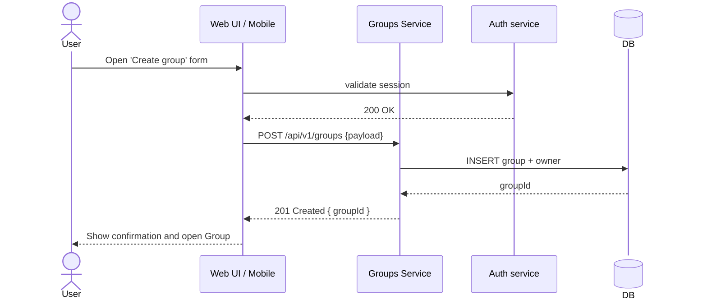
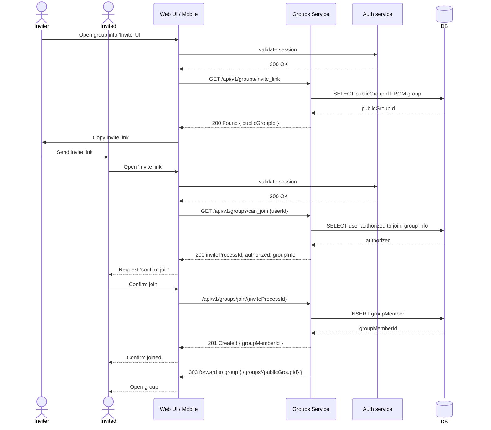
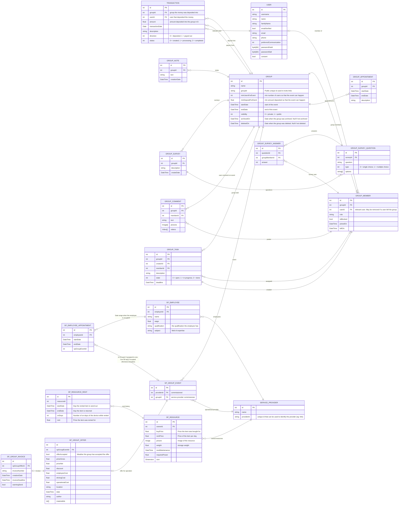

1. Titelblatt, Autoren, Selbstständigkeitserklärung
2. Zusammenfassung (Ziele, Scope, Annahmen)
3. Glossar / Domain‑Begriffe
4. Functional requirements (User‑Stories + zentrale Requirements‑Tabelle)
   - 4.1 Mapping: User‑Stories → Akteure / Use‑Cases
   - 4.2 Akzeptanztests / Test‑Cases (pro Story)
5. 4+1 Sichten (jede Sicht: Ziel, Diagramme, Mapping zu Stories, offene Fragen)
   - 5.1 Use‑case / Szenarien (the "+1"): Use‑case‑Diagramme, Hauptszenarien, Sequenzdiagramme, Akzeptanzkriterien
   - 5.2 Logical View: Domänen‑Klassendiagramm, ER/DB‑Modell, CRUD‑Matrix, Entitäts‑Attribute, VIF
   - 5.3 Development View: Komponenten/Module, Paket‑ und Repo‑Struktur, API‑Contract (OpenAPI), Build/CI
   - 5.4 Process View: Laufzeit‑Architektur, Messaging/Queues, State‑Machines (z. B. Group lifecycle), Performance‑Flows
   - 5.5 Physical View: Deployment‑Diagramm (K8s/VMs), Netz, Sizing, SLO/SLA
6. Nicht‑funktionale Anforderungen (NFR) — messbar: Performance, Security, Privacy, Availability, Scalability
7. Security & Privacy (STRIDE, DSGVO‑Flows, Key‑Management, Aufbewahrung)
8. API & Integration (OpenAPI, Webhooks, Idempotenz, 3rd‑party connectors)
9. Operations & SRE (Monitoring, Logging, Backups, Runbook, Incident‑Response)
10. Testplan / QA (Unit, Integration, E2E, Akzeptanztests, CI/CD‑Gates)
11. Open decisions / Risks / Roadmap (TODOs, Annahmen)
12. Anhänge
    - A: UML‑Quellen (XMI / PlantUML) — siehe `diagrams/` (PlantUML‑Quellen)
    - B: DB‑Schema (DDL + Beispiel‑daten) — `db/schema.sql`
    - C: Mockups / Styleguide — `mockups/`
    - D: Beispiel‑API‑Responses (OpenAPI snippets) — `api/openapi.yaml`
    - E: Traceability‑Matrix (Requirement → Artifact → Test)

---

Für jedes Kapitel (kurze Checkliste / erwartete Artefakte):

- Titelblatt
  - Pflicht: Autor(en), Matrikelnummer(n), Datum, Selbstständigkeitserklärung

---

Hinweis zur Organisation: Die **Requirements‑Tabelle** ist die kanonische Quelle und bleibt in Kapitel 4; in den 4+1‑Sichten referenzierst du Story‑IDs (nicht kopieren). Eine Traceability‑Matrix (Anhang E) verbindet Requirements mit Use‑cases, Klassen, Endpunkten und Tests.


# 2 - Zusammenfassung

Kurzfassung (Executive Summary)

Dieses Dokument beschreibt die Spezifikation für eine Plattform zur Planung, Organisation und Durchführung von Gruppen‑Events (z. B. Reisen, Vereins‑ oder Firmenveranstaltungen). Kernnutzen: Teilnehmer können Gruppen anlegen/verwalten, Termine/Umfragen/Finanzen koordinieren und externe Dienstleister (z. B. Veranstaltungstechnik) buchen. Die Lösung adressiert sowohl Privatnutzer als auch kommerzielle Dienstleister und bietet ein Provider‑Portal, Zahlungs‑ und Rechnungsfunktionen sowie Compliance‑ und Betriebsmechanismen (Monitoring, Backups, DSGVO‑Workflows).

Zielsetzung: Eine sichere, skalierbare Web‑ und Mobile‑Plattform, die Gruppen‑Organisation, Zahlungsabwicklung und Dienstleister‑Management in einem integrierten Workflow unterstützt.

Wichtige Kennzahlen
- Verfügbarkeit (SLA target): 99.5% (kritische Dienste: auth, payments, groups). 
- Performance: Group‑listing — median < 150 ms, 95th‑percentile < 500 ms.
- Durchsatz: skalierbar auf ~10k gleichzeitige aktive Nutzer pro Region (horizontale Skalierung).
- Backup / RPO / RTO: tägliche Backups (RPO = 24 h); RTO kritisch (auth/payments) < 1 h, RTO nicht‑kritisch < 24 h.
- Datenschutz: Lösch‑Workflow abgeschlossen / Anonymisierung innerhalb 30 Tagen; Datenexport innerhalb 7 Tagen.

Scope (konkret)
- In Scope (MVP): User‑Management (Auth, Sessions, 2FA optional), Gruppen (Erstellen, Beitreten, Rollen), Notizen/Termine/Umfragen, Einzahlungen & einfache Abrechnung, Provider‑Listing + Buchung, Basis UI (Web + responsive Mobile), Audit & DSGVO‑Flows.
- Out of Scope (MVP): vollständiges End‑to‑End E2E‑Verschlüsselung, komplexe Market‑Place‑Features (Gebotsauktionen), Enterprise‑SAML (optional später), vollständige Offline‑Mobile‑Funktionalität.

Priorisierte Annahmen
- Nutzerdaten und Transaktionen sind primär in einer zentralen Region gespeichert; system ist regional skalierbar.
- Zahlungen werden über einen externen Provider (Stripe/Adyen) angebunden — Zahlungs‑Reconciliation via API.
- Externe Kalender‑Sync (Google/Outlook/iCal) wird als Integrationsfeature implementiert; initial nur Pull/Sync‑Opt‑in.

Top‑Risiken (priorisiert)
1. Business/Integration: Unklare Payment‑Provider‑Entscheidung verzögert MVP (Mitigation: Auswahl‑kriterien + PoC innerhalb 2 Wochen).
2. Datenschutz: Lösch‑/Export‑Workflow komplex (Mitigation: API‑Contract + automatisierte Tests für Delete/Anonymize).
3. Security: Unzureichende Auth/Session‑Hardening → Account‑Kompromittierung (Mitigation: starke PW‑Policy, 2FA, WAF, regelmäßige Pen‑Tests).
4. Operational: Fehlen von Runbooks/Monitoring führt zu langen Ausfallzeiten (Mitigation: Runbook + SLOs vor Produktionsstart).

Akzeptanzkriterien für die Deliverables (Kurz)
- MVP accepted when: alle "Muss"‑Stories in Kapitel 4 implementiert und durch End‑to‑End‑Tests verifiziert sind; kritische SLOs (auth/payments/group‑listing) werden in Staging‑Loadtests erreicht; DSGVO‑Delete/Export‑Flows getestet.

Empfohlene nächste Schritte (priorisiert)
1. Entscheidung: Payment‑Provider (PoC → 1 chosen) — blocker für Invoicing/Refunds.  
2. Erzeuge Traceability‑Matrix (Requirement → Use‑case → API → Test).  
3. Erstelle Runbook‑Draft für Top‑3 Incidents (auth outage, payment failure, data‑loss).

Akzeptanz der Zusammenfassung
- Diese Zusammenfassung ist akzeptabel, wenn sie in Review von Product Owner bestätigt wird und die drei NFR‑Defaults (SLA, latency, RTO) als Ausgangswerte genehmigt werden.


# 3 - Glossar 

<!--
- Glossar
  - Liste der Domainbegriffe + kurze Definitionen (z. B. Group, Event, Organizer, Provider)
-->

| Name          | Beschreibung  |
| ------------- | ------------- |
| Gruppe        | Eine Sammlung an Nutzern die sich über eine Gruppe austauschen können |
| Benutzer      | Ein Nutzer von unserem Service |
| Dienstleister | Ein Externer Dienstleister der auf unser Platform vertreten ist und von Gruppen beauftragt werden können |
| System        | Stellvertreten für uns als Service oder Serviceanbieter |
| Owner         | Der Benutzer, der eine Gruppe erstellt hat |
| Admin         | Ein Gruppenmitglied mit erhöhten rechten innerhalb einer Gruppe |


# 4 - Funktionale requirements

<!--
- Functional requirements (canonical)
  - Vollständige User‑Stories‑Tabelle (canonical source)
  - Priorisierung (MoSCoW), Acceptance‑Criteria, einfache Akzeptanztests
  - Traceability‑IDs (UIDs) für jede Story
-->

| Name/ID | In meiner Rolle als ... | möchte ich ...                  | , so dass...           | Akzeptiert, wenn...       | Priorität |
| ----------------- | ----------- | --------------------------------- | ---------------------- | ------------------------- | ---- |
| user anmelden     | Benutzer    | mich bei dem Service Anmelden     | ich mich anmelden kann | User können sich anmelden | Muss |
| user registrieren | Benutzer    | mich bei dem Service registrieren | ich mich registrieren kann | User können sich registrieren | Muss |
| user username     | Benutzer    | einen benutzernahmen angeben      | dieser für mich angezeigt wird | User kann username eingeben | Kann |
| user name         | Benutzer    | Meinen legalen Namen angeben können | Rechnungen Automatisch erstellt werden können | der User seinen Namen angeben kann | Kann |
| user email        | Benutzer    | eine E-Mail angeben               | ich benachrichtigt werden kann | User kann E-Mail eingeben | Kann |
| user communication | Benutzer   | meinen bevorzugten Kommunikationsweg angeben | ich über diesen Weg wichtige Benachrichtigungen erhalten kann | der User seinen bevorzugten Kommunikationsweg angeben kann | Kann |
| user password (double) | Benutzer | ein Password angeben (zweimal)  | Schreibfehler werden vermieden | Passwort muss zweimal eingegeben werden; Mindeststärke geprüft (z.B. 8+ Zeichen, Zahl, Sonderzeichen) | Muss |
| password hash     | System      | dass mein Password gehasht und gesaltet wird | Passwörter nicht im Klartext gespeichert werden | Passwörter mit einem modernen KDF (z. B. Argon2/bcrypt) + Salt gespeichert | Muss |
| password reset    | Benutzer    | mein Passwort zurücksetzen können | ich wieder Zugriff erhalte | Reset per E‑Mail mit einmaligem Token (gültig 1 h); nach Reset erfolgt Benachrichtigung an alle aktiven Sessions | Muss |
| session & logout  | Benutzer / System | aktiv angemeldete Sessions verwalten (Logout, Session‑Timeout, Revoke) | Konten sicher bleiben, auch bei Geräteverlust | Benutzer können sich abmelden; Sessions verfallen automatisch (configurierbar); Admin kann Sessions widerrufen | Muss |
| register captcha   | System      | dass der User bei der Registrierung ein Captcha lösen muss | sich Bots nicht so einfach registrieren können | Registrierung kann optional ein Captcha verlangen (konfigurierbar) | Soll |
| E‑Mail verification | System    | dass der User bei der Registrierung seine E‑Mail überprüfen muss | E‑Mail‑Besitz ist verifiziert | Verifikationslink (24 h Gültigkeit); Konto eingeschränkt bis zur Verifikation | Muss |
| user page after login | Benutzer    | nach dem login auf eine Seite mit einer übersicht über Gruppen kommen | ich auf Anhieb eine Übersicht über meine Gruppen habe | wenn die user homepage die Gruppenübersicht ist | Muss |
| Gruppenübersicht      | Benutzer | eine übersicht über Mein, Beigetretenen und Öffentliche Gruppen haben | ich eine Übersicht über die für mich interessanten Gruppen habe | der User eine Übersicht über die Gruppen, denen er beigetreten, die er erstellt und die für ihn interessant sind, hat | Muss |
| Gruppenübersicht sortieren | Benutzer | die Liste der verfügbaren Gruppen sortieren | mir Gruppen entsprechend meines aktuellen Interesses angezeigt werden | der User die angezeigte Liste an Gruppen sortieren kann | Kann |
| Gruppenübersicht navigieren | Benutzer | durch anwählen zu der angewählten Gruppe gelangen | ich mit der Angewählten Gruppe interagieren kann | der User durch anwählen zu einer Gruppe Navigieren kann | Muss |
| Gruppe erstellen      | Benutzer | eine neue Gruppe erstellen können | eine Gruppe mit Start‑/Enddatum anlegen | Pflichtfelder: Name, Sichtbarkeit (öffentlich/privat/hidden); Ersteller = Owner; Erzeugung liefert feste Event‑URL und Join‑Code | Muss |
| Gruppe löschen (Owner) | Owner | eine selbst erstellte Gruppe löschen können | die Daten nicht mehr für Teilnehmer sichtbar sind | Nur Owner kann löschen; Lösch‑Workflow zeigt Folgen (Archivieren vs. vollständiges Löschen) und erfordert Bestätigung | Muss |
| Gruppe beitreten      | Benutzer | einer bestehenden Gruppe beitreten können | ich Teilnehmer der Gruppe werde | Beitritt per Join‑Code / Einladungs‑Link oder öffentliche Gruppe; Beitritt erscheint sofort in Mitgliederliste | Muss |
| Gruppenmitglieder     | Gruppenmitglied | sehen, wer sonst noch in der Gruppe ist | ich weiß, wer teilnimmt | Mitgliederliste mit Rollen (Owner, Admin, Member); Datenschutz: nur für berechtigte Nutzer sichtbar | Muss |
| Invite‑Code verwalten | Owner / Admin | Join‑Codes erzeugen, Ablaufdatum setzen und widerrufen | nur berechtigte Personen beitreten können | Codes haben optionales Ablaufdatum; Owner kann Codes sofort invalidieren | Muss |
| Gruppeneinladung link | Benutzer | einer Gruppe über einen festen Link beitreten können | einfache Einladung möglich ist | Einladungs‑Link ist stabil oder hat konfigurierbares Ablaufdatum; Nutzung protokolliert | Muss |
| Gruppeneinladung qr   | Benutzer | einer Gruppe über einen QR‑Code beitreten können | einfacher Beitritt via Mobilgerät | QR codiert die Event‑URL/Join‑Code; Ablaufregel wie bei Link | Kann |
| Gruppenbeschreibung setzen    | Gruppenmitglied | eine Gruppenbeschreibung setzen | klarer Kontext für die Gruppe | Beschreibung editierbar; Änderungen protokolliert; nur berechtigte Rollen dürfen großflächig bearbeiten | Kann |
| Gruppe verlassen              | Gruppenmitglied | eine Gruppe verlassen können | ich erhalte keine weiteren Benachrichtigungen | Mitglieder können selbstständig austreten; Einzahlungen werden gemäß Regeln behandelt (siehe Einzahlungs‑Policy) | Muss |
| Gruppe Mindestteilnehmer      | Owner / Admin | eine Mindestteilnehmerzahl festlegen | Event findet nur ab Mindestanzahl statt | Mindestanzahl wird angezeigt; bei Unterschreitung Benachrichtigung an Owner | Muss |
| Gruppe Mindestbetrag (vereint) | Owner / Admin | einen Mindestbeitrag für das Event festlegen | Finanzierungssicherheit des Events | Mindestbetrag sichtbar auf Event‑Homepage; System meldet "erreicht"/"offen"; automatische Aktionen (z. B. Cancel/Refund) konfigurierbar | Muss |
| Gruppe max. Einzahlung (optional) | Gruppenmitglied | optional ein System‑Limits setzen/anzeigen | Missbrauch oder Fehler vermeiden | System kann ein optionales Oberlimit pro Zahlung konfigurieren; wenn nicht gesetzt, gilt "kein Limit" | Kann |
| Gruppe Einzahlungsübersicht   | Gruppenmitglied | Übersicht über alle eingegangenen Zahlungen | ich sehe wer wie viel bezahlt hat | Tabelle mit Beträgen, Datum, Zahler; Summen und ausstehender Betrag; Export (CSV/JSON) möglich | Muss |
| Gruppe Kassensturz | Gruppenmitglied | eine Übersicht über alle Ausgaben der Gruppe habe | ich diese den Einzahlungen gegenüber stellen kann | Gruppenmitglieder eine Übersicht über die Ausgaben einer Gruppe haben | Muss | 
| Gruppe Info-Übersicht         | Gruppenmitglied | eine Chronologische übersicht über alle Notizen, Termine und Umfragen | neue Infos auf den ersten Blick erkenne | Gruppenmitglieder eine chronologische Übersicht über die Gruppeninformationen haben | Muss |
| Gruppe Info-Übersicht sortieren | Gruppenmitglied | die Angezeigten Infos sortieren können | die für mich relevanten Infos an erste stelle stehen | Gruppenmitglieder können die angezeigten Infos sortieren | Kann |
| Gruppe Notizen                | Gruppenmitglied | der Gruppe eine neue Notiz hinzufügen | ich Infos und Erlebnisse mit den anderen Gruppenmitgliedern teilen kann | Gruppenmitglieder neue Notizen hinzu fügen können | Muss |
| Gruppen Termine               | Gruppenmitglied | der Gruppe ein neues Datum als Termin hinzufügen können | ich wichtige Termine mit den anderen Gruppenmitgliedern Teilen kann | Gruppenmitglieder einer Gruppe Termine hinzufügen können | Muss | 
| Gruppenumfragen               | Gruppenmitglied | der Gruppe eine Umfrage hinzufügen können | ich die Präferenzen der anderen Gruppenmitglieder erfragen kann | Gruppenmitglieder Umfragen erstellen können | Kann |
| Umfrage type | Gruppenmitglied | Umfragen mit verschiedene Typen erstellen | ich Gruppenmitgliedern Single und Multiple choice fragen stellen | Gruppenmitglieder bei der Erstellung von Umfragen die Wahl zwischen Single und Multiple choice Aufgaben haben | Muss |
| Zufriedenheit‑Umfrage         | Gruppenersteller | nach dem Event / Urlaub eine Zufriedenheitsumfrage erstellen | ich weiß, wie zufrieden die Gruppenmitglieder mit der Planung / Durchführung des Events waren | Gruppenersteller nach einem Event eine Zufriedenheitsumfrage an die Gruppenmitglieder senden können | Kann |
| Gruppendokumentation (Media)  | Gruppenmitglied | Kommentare, Bilder und Videos hochladen | Event dokumentieren | Upload erlaubt (Whitelist‑MIME), Max‑Größe konfigurierbar, Moderations‑Flag | Kann |
| Gruppen‑Lifecycle (state machine) | Owner / System | Eventzustände (Draft→Open→Confirmed→Cancelled→Archived) verwalten | automatisierbare Abläufe möglich | Zustandsübergänge definiert; bei Cancel automatischer Refund‑Pfad / Benachrichtigung möglich | Muss |
| Zahlungs‑Webhook Idempotenz   | System      | eingehende Payment‑Events idempotent verarbeiten | keine Doppelbuchungen entstehen | Webhook‑Events mit Idempotency‑Key; wiederholte Zustellungen erzeugen kein Duplikat | Muss |
| Gruppen‑Zeitraum              | Gruppenmitglied | einen Zeitpunkt / Zeitraum festlegen | ich kommuniziere, wann das Event stattfindet | Start/End‑Datum vorhanden; Zeitzone angegeben; wiederkehrende Termine optional | Muss |
| Gruppen: Aufgaben (create) | Gruppenmitglied | Aufgaben erstellen | Team-Aufgaben verwaltbar sind | Neue Aufgabe wird in Gruppen-Task‑Liste angezeigt; Pflichtfelder: Titel, Fälligkeitsdatum; API-Response 201 | Muss |
| Gruppen: Aufgabe zuweisen | Gruppenmitglied | Aufgaben einem Mitglied zuweisen | Zuständigkeiten klar sind | Zuweisung ändert Task-Status; Benachrichtigung an Empfänger innerhalb 5 min | Muss |
| Gruppen: Aufgabe abschließen | Gruppenmitglied | Aufgabe als erledigt markieren | Aufgabenstatus aktuell ist | Statuswechsel sichtbar für alle Mitglieder; Änderungs-Log vorhanden | Muss |
| Aufgaben: Erinnerungen (configurable) | Gruppenmitglied | Erinnerungen per bevorzugtem Kanal erhalten | Deadlines nicht verpasst werden | Erinnerung per E‑Mail/Push/SMS laut Präferenz; konfigurierbar; Zustellung innerhalb 5 min vor Fälligkeit (configurable) | Kann |
| Rollen & Rechte (RBAC Basis) | Gruppen-Owner | Rollen (Owner/Admin/Member) vergeben | Zugriff und Aktionen steuerbar sind | Owner kann Rollen ändern; Berechtigungen enforced (z. B. nur Owner kann Gruppe löschen) | Muss |
| Owner auto‑assignment | Gruppenersteller | nach Erstellung Owner sein | Einstellungen verwalten zu können | Ersteller ist Owner; Owner-Flag in DB gesetzt | Muss |
| Mitgliederverwaltung | Gruppen-Admin | Mitglieder entfernen / einladen | Moderation möglich ist | Admin kann Mitglied entfernen; Aktion audit‑logged; entfernte Nutzer verlieren Zugriff sofort | Muss |
| Editions: Community / Premium | User | freie / kostenpflichtige Pläne nutzen | Produkt‑Limits durchsetzen | Community: ≤3 aktive Gruppen; Premium: keine Limit; Abrechnung aktiviert für Premium | Muss |
| Multi‑device parity | User | gleiches Funktionsset auf allen Geräten | konsistente UX | Kernfunktionen auf Mobile/Web verfügbar; responsives Layout (breakpoints) | Muss |
| Dienstleister: Listing & Angebot | Dienstleister | Dienstleistung einstellen & Angebot erstellen | Veranstalter finden passende Anbieter | Listing mit Pflichtfeldern; Angebot enthält Preise (Netto/Brutto), Positionen, Fotos; Download als PDF möglich | Muss |
| Dienstleister: Buchung & Budget | Gruppenmitglied | Dienstleister buchen; Budget setzen | Planung & Kostenkontrolle möglich | Buchung erzeugt Reservierung; Budget‑Limit verhindert Überbuchung; Bestätigung & Storno‑API vorhanden | Muss |
| Dienstleister: Ressourcen & Mitarbeiter | Dienstleister | Material & Personal verwalten | Verfügbarkeit planbar ist | Ressourcen können geblockt/entblockt werden; Mitarbeiter‑Calendar sichtbar; Konflikte verhindert | Muss |
| Bewertungen & Feedback | Gruppenmitglied | Dienstleister bewerten | Qualität transparent wird | Bewertung nur nach abgeschlossenem Event; Anzeige mittelt Bewertungen; Missbrauchs-Moderation möglich | Kann |
| Material‑Lifecycle (Wartung) | Dienstleister | Wartungszyklen verwalten | Ausfälle planbar sind | Wartungs‑Reminder configurable; Historie pro Asset vorhanden | Muss |
| Abrechnung: Rechnung + Mahnwesen | Dienstleister / Organisator | Rechnungen automatisch erzeugen / Mahnungen senden | Zahlungen eingetrieben werden | Rechnung generiert aus Angebot; PDF/CSV-Export; Mahnung nach konfigurierbarer Frist (z. B. 30 Tage) | Muss |
| DSGVO – Datenexport & Löschung | Benutzer | meine Daten exportieren/ löschen lassen | Recht auf Auskunft / Vergessenwerden erfüllt ist | User kann vollständigen Datenexport (JSON/CSV) anfordern; Löschung führt zu Anonymisierung/Entfernung innerhalb 30 Tage; Audit-Log der Anfrage | Muss |
| Sicherheit: Auth & Sessions | Benutzer/System | 2‑Faktor, Session‑Timeout, Account‑Lockout | Konten sicher sind | Passwort-Hashing mit Argon2/bcrypt; 2FA optional; Session default 30 min idle; Account lock after 5 failed attempts (configurable) | Muss |
| Payments: Webhook Idempotenz & Refunds | System | sichere Zahlungsabwicklung | keine Doppelbuchungen; Rückerstattungen möglich | Webhooks idempotent; Refunds via API in <72 h; reconciliations reportierbar | Muss |
| Observability & Ops | Betreiber | Monitoring, Logging, Backups | Betriebssicherheit gewährleistet | 99.5% availability target (SLA); zentrale Logs (retention 90d); tägliche Backups; Alerts bei Fehlern | Soll |
| API: Contract & Rate Limits | Integrator | stabile API nutzen | Integration zuverlässig bleibt | OpenAPI spec vorhanden; 95th pct response <500ms; rate limit 1000 req/min per API key | Soll |
| Accessibility (WCAG) | User | barrierefreien Zugang haben | inklusiver Betrieb | WCAG 2.1 AA für Kern-User‑Flows | Soll |
| Testing & CI/CD | Entwickler | automatisierte Qualitätssicherung | Regressionen verhindert werden | Unit/Integration/E2E in CI; PRs müssen CI grünes Licht haben | Muss |

<!--
### Ergänzende nicht‑funktionale Anforderungen (Auswahl / messbar)
- Performance: 95th‑percentile API latency < 500 ms für Kernendpunkte (list/create/join).
- Skalierbarkeit: System skaliert horizontal bei 50% CPU‑Auslastung der Instanzgruppe.
- Sicherheit: TLS 1.2+ enforced; Secrets in KMS; regelmäßige Pen‑Tests (Jährlich).
- Datenschutz: Datenexport (JSON/CSV), Lösch‑Workflow, Einwilligungs‑Logging für E‑Mails.
-->

# 5. 4+1 Sichten

## 5.1 Use‑case / Szenarien
<!--
- Use‑case / Szenarien
  - Use‑case‑Diagramm (Actors + top 10 Use‑cases)
  - 3–5 Sequenzdiagramme (z. B. Create Group, Book Provider, Payment + Refund)
  - Mapping Story→Use‑case
-->

### Gruppe erstellen
A user sends a request to create a new group. His session is validated and on successful validation the group is created. After the group is created the user can be redirected to the groups page.





#### Gruppendaten
```
{
  name : Provided by user
  groupId" : Automatically generated unique id
  visibility : Provided by user (default Private)
}
```


### Gruppe über link beitreten
An exiting group member can access an invite link through the UI. This invite link can be send to other users. 
If another user opens that invite link, the join process is stared. First it is validated if the user is allowed to join the group (ie: not blocked, etc.). If the user is allowed to join the User is displayed basic information about the Group so that he can ensure that he is joining the group he is intending to. If the user confirms, the user is added as a group member. The user the receives confirmation of the successful join and is redirected to the groups page.
If the user is already part of the group he can be redirected to the groups page directly.




### TODO


## 5.2 Logical View: Domänen‑Klassendiagramm, ER/DB‑Modell, CRUD‑Matrix, Entitäts‑Attribute, VIF
<!--
- Logical View
  - Domänen‑Klassendiagramm (Entitäten + Schlüsselattribute)
  - ER‑Diagram + CRUD‑Matrix
  - Daten‑Retention & Privacy per Entität
-->

### ER - Model


<!--
different diagram layout
---
title: Order example
config:
    layout: elk
---
-->




## 5.3 Entwicklerübersicht: Komponenten/Module, Paket‑ und Repo‑Struktur, API‑Contract (OpenAPI), Build/CI
<!--
- Development View
  - Komponentenübersicht (groups‑service, auth, payments, provider‑portal, ui)
  - API‑Endpunkte (stubs) für Kernflows (Groups, Membership, Payments)
  - Build/CI Übersicht, Dependency‑Matrix
-->

### Komponenten

 * Website
 * Mobile app
 * Authentication service
 * Gruppenservice
 * ProviderPortal
 * ProviderService
 * Datenbank
  
### Repositories
 * Website
 * Mobile app
 * Api-services

### Api-endpunkte

Api prefix: `api/v1/`

#### User
 * GET user/{userId}
 * POST user/: {payload}
 * PUT user/{userId}: {payload}
 * DELETE user/{userId}

#### Groups
 * GET groups/{groupId}
 * GET groups/
 * POST groups/: {payload}
 * PUT groups/{groupId}
 * DELETE groups/{groupId} 
  
 + GET groups/start_join/{groupId}
 + PUT groups/join: {joinId}
 + GET groups/{id}/invite  

 * GET groups/{id}/member
 * GET groups/{id}/member/{id}
 * POST groups/{id}/member: {payload}
 * PUT groups/{id}/member/{id}

 + GET groups/{id}/note
 + GET groups/{id}/note/{id}
 + POST groups/{id}/note/: {payload}
 + PUT groups/{id}/note/{id}: {payload}
 + DELETE groups/{id}/note/{id}

 * GET groups/{id}/comment
 * GET groups/{id}/comment/{id}
 * POST groups/{id}/comment/: {payload}
 * PUT groups/{id}/comment/{id}: {payload}
 * DELETE groups/{id}/comment/{id}

 + GET groups/{id}/survey
 + GET groups/{id}/survey/{id}
 + POST groups/{id}/survey {payload}
 + PUT groups/{id}/survey/{id} {payload}
 + DELETE groups/{id}/survey/{id}
 + POST groups/{id}/survey/{id}/answer/ {payload}

 * GET groups/{id}/finance
 * POST groups/{id}/finance/deposit {payload}
 * POST groups/{id}/finance/withdraw {payload}

 + GET groups/{id}/appointments {parms: format=[google, ical]}

 * GET groups/{id}/task
 * GET groups/{id}/task/{id} 
 * POST groups/{id}/task/: {payload}
 * PUT groups/{id}/task/{id}: {payload}
 * DELETE groups/{id}/task/{id}
  
#### Providers

 * GET    provider/
 * GET    provider/{id}
 * POST   provider/: {payload}
 * GET    provider/{id}: {payload}
 * DELETE provider/{id}

 + GET    provider/{id}/employee
 + GET    provider/{id}/employee/{id}
 + POST   provider/employee/: {payload}
 + GET    provider/{id}/employee/{id}: {payload}
 + DELETE provider/{id}/employee/{id}
  
 * GET    provider/{id}/employee/{id}/appointments
 * GET    provider/{id}/employee/{id}/appointments/{id}
 * POST   provider/employee/{id}/appointments/: {payload}
 * GET    provider/{id}/employee/{id}/appointments/{id}: {payload}
 * DELETE provider/{id}/employee/{id}/appointments/{id}

 + GET    provider/{id}/resource
 + GET    provider/{id}/resource/{id}
 + POST   provider/resource/: {payload}
 + GET    provider/{id}/resource/{id}: {payload}
 + DELETE provider/{id}/resource/{id}

#### Events managed by provider

 * GET  event/
 * GET  event/{id}
 * POST event {payload}
 * PUT  event/{id} {payload}
 
 * POST event/application {payload}
 * POST event/invoice {payload}


## 5.4 Prozessübersicht: Laufzeit‑Architektur, Messaging/Queues, State‑Machines (z. B. Group lifecycle), Performance‑Flows
<!--
- Development View
  - Komponentenübersicht (groups‑service, auth, payments, provider‑portal, ui)
  - API‑Endpunkte (stubs) für Kernflows (Groups, Membership, Payments)
  - Build/CI Übersicht, Dependency‑Matrix
-->


## 5.5 Physical View: Deployment‑Diagramm (K8s/VMs), Netz, Sizing, SLO/SLA
<!--
- Physical View
  - Beispiel‑Deployment (k8s/VM), Netz‑Diagram, Storage/BLOB, CDN
  - Backup/Restore, DR‑Plan, Sizing‑Annäherungen
-->


---

# 6 Nicht‑funktionale Anforderungen (NFR) — messbar: Performance, Security, Privacy, Availability, Scalability


# 7 Security & Privacy (STRIDE, DSGVO‑Flows, Key‑Management, Aufbewahrung)

<!--
- NFRs & Security
  - Messbare NFR‑Tabelle (SLO/SLA, retention, latency, throughput)
  - STRIDE‑Kurzanalyse + Controls (Auth, KMS, Rate‑limit, CSP)
  - DSGVO: Datenexport & Lösch‑Workflow (API + delays)
  - 
-->

# 8 API & Integration (OpenAPI, Webhooks, Idempotenz, 3rd‑party connectors)

<!--
- API & Integration
  - OpenAPI‑stubs für Kernressourcen
  - Webhook contract (idempotence), retry semantics
  - 3rd‑party integration checklist (payment, calendar sync)
-->

# 9 Operations & SRE (Monitoring, Logging, Backups, Runbook, Incident‑Response)

<!--
- Operations & Testplan
  - Monitoring KPI list, runbooks for top‑5 incidents
  - CI/CD gates + Testmatrix (unit/integration/e2e/manual)
-->

# 10 Testplan / QA (Unit, Integration, E2E, Akzeptanztests, CI/CD‑Gates)

# 11 Anhänge 

<!--
- Anhänge
  - PlantUML/XMI, DDL, Mockups (png/svg), Beispiel‑API‑responses, Traceability CSV
-->

## Anhang E — initiale Traceability‑Matrix (Auszug)

| Requirement ID | Kurzbezeichnung | Use‑case | Component | API endpoint | Testcase ID |
|---|---|---|---|---|---|
| REQ-001 | User login | Authenticate user | auth-service | POST /api/v1/auth/login | TC-001 |
| REQ-003 | Create group | Create Group | groups-service | POST /api/v1/groups | TC-010 |
| REQ-004 | Join group | Join Group | membership-service | POST /api/v1/groups/{group_id}/join | TC-011 |
| REQ-006 | Book provider | Provider booking | booking-service | POST /api/v1/providers/{id}/book | TC-030 |
| REQ-007 | Payment webhook idempotence | Payment notification | payments-service | POST /api/v1/payments/webhook | TC-040 |
| REQ-009 | Data export | User data export | export-service | GET /api/v1/users/{id}/export | TC-050 |

Details / Dateien:
- Vollständige CSV (expandable): `SoftwareTechnik/traceability.csv`
- Sequenzdiagramme (PlantUML): `SoftwareTechnik/diagrams/create_group.puml`, `.../book_provider.puml`, `.../payment_refund.puml`

<!--
Hinweis: das oben ist ein initialer, prüfbarer Auszug für die wichtigsten MVP‑Flows — erweitere die CSV, bis jede Story aus Kapitel 4 abgebildet ist.
-->


