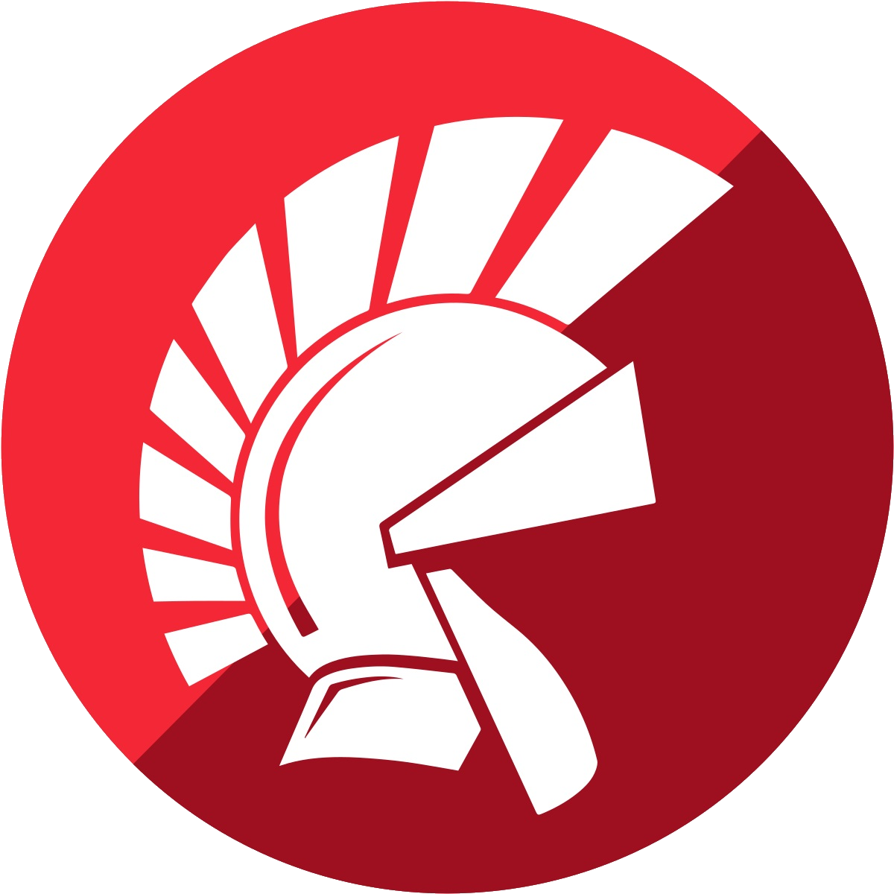
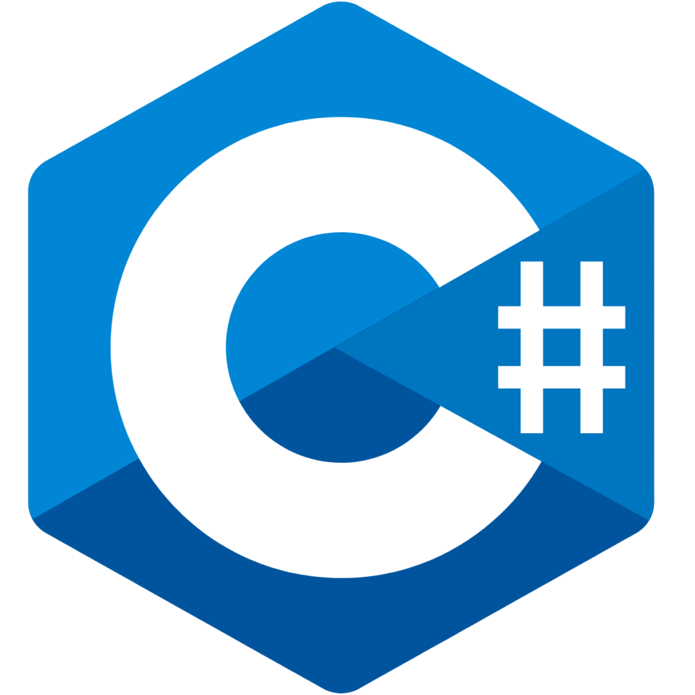
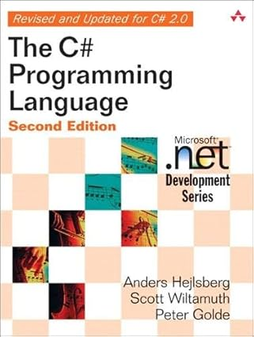
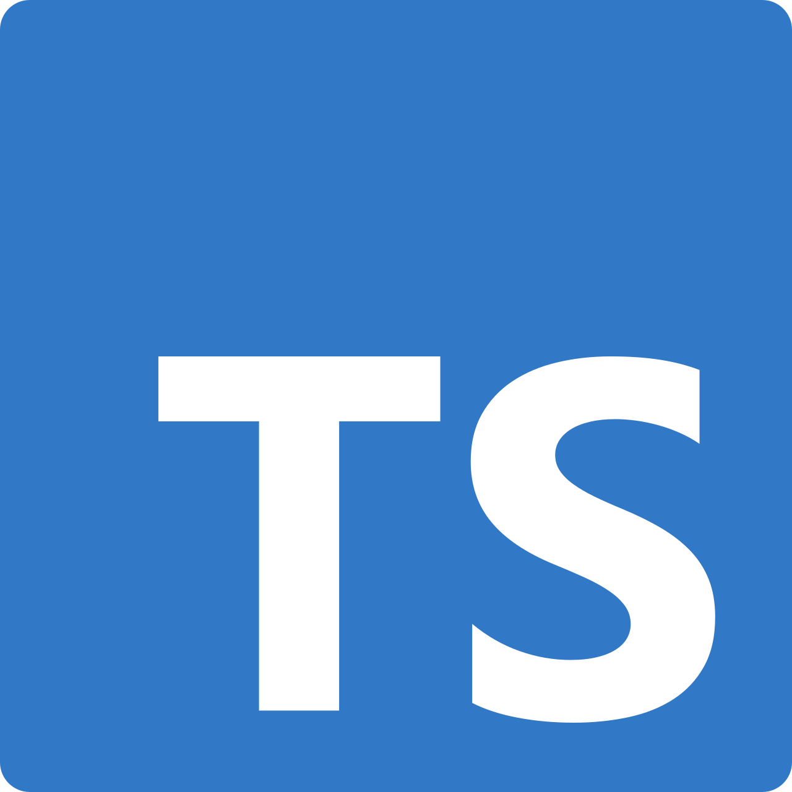
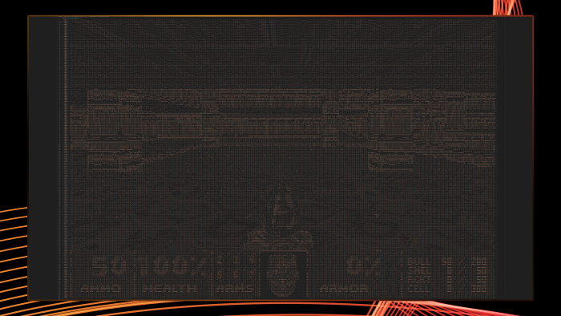

---

# Anders Hejlsberg


<!--
So sieht er aus

Image: Professional Developers Conference 2008
[Image] 05.11.2025 https://en.wikipedia.org/wiki/Anders_Hejlsberg#/media/File:Anders_Hejlsberg.jpg
-->

---

## Warum?
 * Turbo Pascal
 * Delphi
 * .NET / C#
 * TypeScript

<!--
Warum beschäftigen wir uns mit ihm?
-->

---

# Verlauf

 * Geburt
 * Leben
 * ~~Tod~~

<!--
Spoiler: irgendwann stirbt er
-->

---

## Technische Daten

|            |     |
| :--------- | --- |
| Name       | Anders Hejlsberg
| Geburtstag | 2.12.1960 (64 Jahre)
| Ort        | Copenhagen, Denmark
| Studium    | Engineering @ Technische Universität Dänemark

<!--

Er hatte Glück, dass seine Schule Computer hatte.
Erste Programiersprache: Algol [1, 1:10]


[1] 05.11.2025 https://www.youtube.com/watch?v=6udlQakSXZY 
[2] 03.11.2025 https://web.archive.org/web/20090427201423/http://www.microsoft.com/presspass/exec/techfellow/Hejlsberg/default.mspx 
-->

---

## 1980 - 1982: Pascal

 * Turbo Pascal
 * Borland
 * Erste IDE


<!--
 * Pascal compiler.
 * Lizenziert von Borland
 * Editor und Debugger hinzugefügt (Nicht von Hejlsberg). War eine der ersten IDEs

[1] 05.11.2025 https://www.youtube.com/watch?v=6udlQakSXZY 
[Image] 05.11.2025 https://www.youtube.com/watch?v=6udlQakSXZY
-->

---

## 1991: Delphi
 * Windows 
 * Delphi
 * Chefentwickler



<!--

 * Windows veröffentlicht
 * Delphi mit support für Windows GUIs
 * Chefentwickler für ersten 3 Versionen
 * Noch heute bei: embarcadero, Kosten: 1.682€
 * Experimental: Visual Programming (Software ICs), skaliert furchtbar [1, 7:20]

[1] 05.11.2025 https://www.youtube.com/watch?v=6udlQakSXZY

-->

---

```delphi
program ArrayLoop;
{$APPTYPE CONSOLE}  
const a : array[1..3] of real = ( 1.1, 2.2, 3.3 );
var f : real;
begin
  for f in a do
    WriteLn( f );    
end.
```

---

## 1996: Angebot

 * Microsoft: .5 Mio
 * Borland: Kontenangebot
 * Microsoft: verdoppelt
 * Wechsel Oktober 1996
  
<!--
Borland verklagt Microsoft wegen Abwerbetaktik.
Borland gewinnt, Hejlsberg hat aber bereits gewechselt.
Hejlsberg gibt an das er sich nicht mehr für Unverzichtbar hält und neue Herausforderungen gesucht hat.
Hejlsberg vermisst "direction" bei Borland
Bil Gates hat ihn Persönlich eingeladen

[1] 05.11.2025 https://www.youtube.com/watch?v=6udlQakSXZY
[2] 05.11.2025 https://web.archive.org/web/20211206140132/https://titanwolf.org/Network/Articles/Article?AID=65cd7255-831c-4237-becc-bd864605cd35
[3] 05.11.2025 https://web.archive.org/web/20210308201951/https://www.infoworld.com/article/2077058/news-and-new-product-briefs--10-01-97-.html?page=2
-->

---

## 1996+: Visual J++

 * Microsofts Java Implementierung
 * Unzureichende JVM Kompatibilität
 * Klage von Sun

<!--
Alles wird Java. Java überall.
J++: Implementierung von Java und Microsofts JVM.
Später J# -> Java für .NET Framework
Proprietär Implementierung für windows.
Implementierung nicht vollständig Kompatible mit JVM.
Microsoft > Proprietär, Sun > Plattformunabhängig.
MS verliert Rechtsachtreit
MSJVM auf (veralteter) Java version 1.1.4 gefreezed.
Aus für J++

[1] 05.11.2025 https://www.youtube.com/watch?v=6udlQakSXZY
[2] 05.11.2025 https://web.archive.org/web/20210308201951/https://www.infoworld.com/article/2077058/news-and-new-product-briefs--10-01-97-.html?page=2

-->

---

## 2000: .NET Framework


 * C++, VisualBasic, J++ inkompatibel
 * Gemeinsame basis
  
<!--
Die primären Programmiersprachen auf Windows: C++, VisualBasic, J++ sind grundsätzlich inkompatibel.
.NET als gemeinsame basis.
Bessere basis für Microsofts Kunden, als ein Lizenziertes Produkt.

CLR - Common Language Runtime [1, 20:00]
 -> Hauptsächlich C#, F#, Powershell


[1] 05.11.2025 https://www.youtube.com/watch?v=6udlQakSXZY

-->

---

## 2000: C#

 * Leitender Designer
 * Einfachheit von VisualBasic
 * Stärke von C++


<!--
Ohne J# wird eine neue Sprache für das .NET framework benötigt.
Daraufhin entwickelt Hejlsberg C#

C# ist von Java inspiriert, so wie Java von anderen Sprachen inspiriert ist.
Jeder der die Vergangenheit ignoriert wird dafür bestraft. [1, 10:26]

Entwickler wollten die Einfachheit / "Ease of use" von VisualBasic und die Stärke von C++. [1, 11:00]

[1] 05.11.2025 https://www.youtube.com/watch?v=6udlQakSXZY
-->

---

<style>
    .container {
        display: flex;
    }
    .col {
        flex: 1;
    }
</style>

# 2001

<div class="container">

<div>
<p>Dr. Dobb's Excellence in Programming Award</p>

<i>
"Über arbeiten an TurboPascal bis C#, hat Anders Hejlsberg signifikante Beiträge zu der Kust und der Wissenschaft des Programmierens getätigt." [1]
</i>
</div>

<div class="col">

</div>

</div>

<!--

[1] 03.11.2025 https://web.archive.org/web/20140708060629/https://www.drdobbs.com/windows/dr-dobbs-excellence-in-programming-award/184404602

-->

---



## C#
 * 2005: Generics, partielle Typen, ...
 * 2008: Extension members, LINQ, ...
 * 2012: async, await, ...


<!--

[1] 05.11.2025 https://www.webdevtutor.net/blog/c-sharp-history

-->

---

```C#
public static class MyClass<T>
{
    public static Type MyType() { return typeof(T); }

    // LINQ / extension member Beispiel
    public static IEnumerable<T> MyFunc(this IEnumerable<T> collection) {
        return collection
            .Where(x => ...)
            .Select(x => ...)
            .OrderBy(x => ...);
    }

    // async / await Beispiel
    public static async Task<string> MyAsyncFunc(HttpClient client) {
        var result = await client.GetAsync("example.com");
        if (!result.IsSuccessStatusCode) { ... }
        return await result.Content.ReadAsStringAsync();
    }
}

```


---

### Buch: "The C# Programming Language"


<!--
"The C# Programming Language" beispiel von 2006
[1] 05.11.2025 https://www.amazon.de/C-Programming-Language-Anders-Hejlsberg/dp/0321334434
-->

---

## ab 2010

 * Umstellung auf Roslyn Compiler 
 * Open Source
 * Langeweile
 * #Script
 

<!--

2012 ist der C# compiler auf den Roslyn compiler umgestellt worden (C# basierend).

Öffentlich Verfügbar auf BUILD 2014 [1]
Hejlsberg veröffentlichte das repo live. [1]
Erster release Visual Studio 2015 [1]

Während dieser Zeit hat das Design team nicht viel zu tun.
Was machen Langauge Designer wen sie nichts zu tun haben?

Sprache im web nicht Java sonder JavaScript
JavaSCript Projekte wachsen, JavaScript Skaliert aber nicht.
Webentwickler habe nach einem C# -> Javascript transpiler gefragt [2, 24:20]

Tools für erwachsene. eg: Refactoring

Hejlsberg -> C# nicht für webentwicklung  geeignet
Er hat mit C# nicht mehr viel selbst Programmiert

[1] 05.11.2025 https://www.heise.de/hintergrund/Neues-zu-Roslyn-und-C-2292919.html
[2] 05.11.2025 https://www.youtube.com/watch?v=6udlQakSXZY
-->

---

## Typescript

 - JavaScript mit Typen

## Compiler
 * C
 * Objektorientiert
 * Funktional / Javascript style



<!--
Erster compiler in C Zusamengebastelt (Konzept) [1]
Zweiter compiler wie C# (viele Klassen / Objektorientiert) [1]

Funktionales paradigm in Javascript. [1]
Compiler war 5x kleiner und 5x schneller [1]
Basis bis heute. (Vor kurzem auf GO umgestellt) [1]

Hejlsberg hat nicht damit gerechnet, das Typescript so populär wird [3, 18:00]

TypeScript nicht weitere Sprache die nach JavaScript Transpiriere,
sonder "fixt JavaScript"[3, 21:30]

[1] 05.11.2025 https://www.youtube.com/watch?v=nhVA0-iDbF4
[2] 25.10.2025 https://github.com/microsoft/TypeScript/graphs/contributors 
[3] 05.11.2025 https://www.youtube.com/watch?v=6udlQakSXZY
[Icon] 05.11.2025 https://en.wikipedia.org/wiki/TypeScript#/media/File:Typescript.svg

-->


---

```typescript
type ID = string;
interface Task { id: ID; title: string; done: boolean }

const makeId = () => Math.random().toString(36).slice(2,8);

class Store {
  private tasks = new Map<ID,Task>();
  add(title: string){ 
    const t: Task = { id: makeId(), title, done: false }; 
    this.tasks.set(t.id,t); 
    return t;
  }
  list(){ return [...this.tasks.values()]; }
  complete(id: ID){ const t = this.tasks.get(id); if(t) t.done = true; return t; }
}

(async()=>{
  const s = new Store();
  const a = s.add("Write slide");
  s.add("Review");
  s.complete(a.id);
  console.log(s.list());
})();
```

---




<!--
FunFact: Typescripts Typesystem ist Turing complete [2, 19:00]

[1, Image] 05.11.2025 https://www.golem.de/news/spiele-und-programmiersprachen-doom-laeuft-in-typescript-2502-193769.html
[2] 05.11.2025 https://www.youtube.com/watch?v=6udlQakSXZY
-->

---


## Person

 - Neutral
 - Zuhörer


<!--

Hejlsberg ist bekannt dafür sich alle Standpunkte neutral anzuhören.
EG: "checked Exceptions"

[1] 05.11.2025 https://www.artima.com/articles/the-trouble-with-checked-exceptions
[Image] 05.11.2025 https://www.youtube.com/watch?v=nhVA0-iDbF4
-->

---


<!--

More:
https://www.artima.com/articles/the-c-design-process
-->

---


---