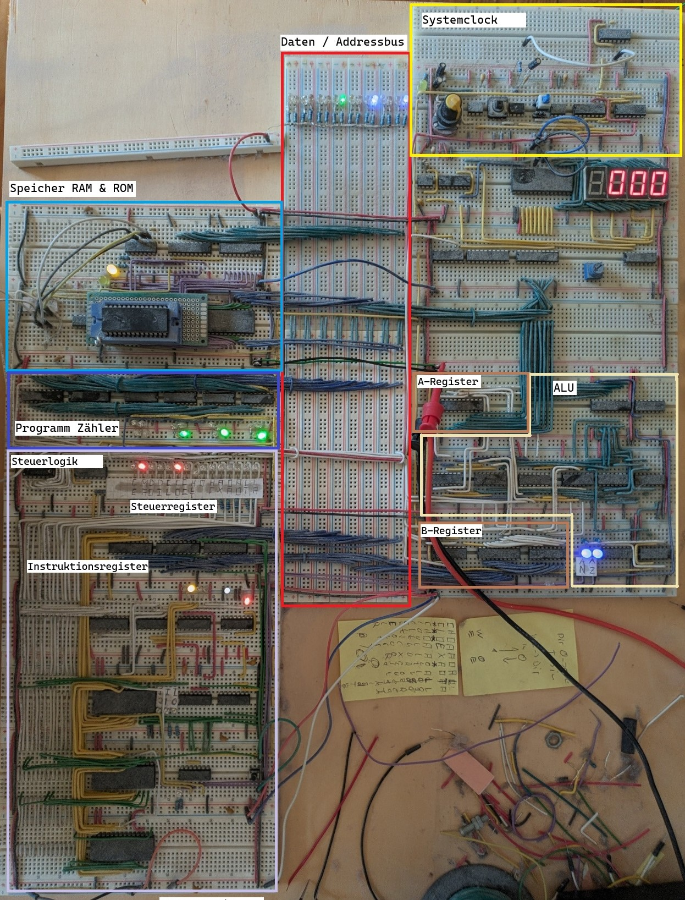

## Clock
Unter der Clock versteht man den Impulsgeber eines Prozessors. Mit jedem Impuls der Clock führt der Prozessor einen Schritt aus. Dadurch gibt die Clock auch die Geschwindigkeit des Prozessors aus. Jeh schneller die Clock, desto schneller der Prozessor. Man kann die Geschwindigkeit der Clock allerdings nicht unbegrenzt erhöhen, da die restlichen Komponenten des Prozessors nur begrenzt schnell arbeiten können. Man muss daher die schellst-mögliche Frequenz finden, bei der die Restlichen Komponenten weiterhin zuverlässig arbeiten. Außerdem steigt mit der erhöhten Rechengeschwindigkeit auch der Strombedarf des Prozessors. Eine geringere Frequenz kann also Vorteilhaft sein, wenn man Energie Sparen möchte. Zum Beispiel weil die maximale mögliche Energieaufnahme begrenzt ist. 
Als Clock signal kann Grundsätzlich jedes Rechtecksignal verwendet werden. üblicherweise verwendet man jedoch einen Quarz, wodurch die Impulse eine sehr genaue Frequenz haben. Der Prozessor kann anhand der Zyklen die genaue Vergangene zeit bestimmen. Ein Quarz wird aber nicht zwingen gefordert. Häufig besitzen Mikroprozessoren eine eingebaute RC Schaltung, die zur Erzeugung des Clock Impulses verwendet werden kann. Diese ist jedoch nicht so genau wie ein Quarz. (Sie kann sich zB. bei Temperatur Änderungen verändern). Theoretisch ist es sogar möglich, einen Taster zu verwenden, wodurch eine Art Schritt-Betrieb erreicht wird. Das ist aber lediglich wür experimentelle / forschende Zwecke sinnvoll. Zu dem haben moderne Prozessoren eine Mindestgeschwindigkeit und Arbeiten nicht mehr richtig, wenn die Clock zu langsam ist.

## Register
Ein Register ist die schellst Speicherart in einem Prozessor und halten die Daten, mit denen der Prozessor im augenblick arbeitet.

## Programmzähler
Der Programmzähler enthält die Speicheradresse der nächsten, aufzuführenden Instruktion dar. Am Anfang eines Instruktionszyklus wird die Instruktion, an der, von dem Programmzähler vorgegebene Speicheradresse in das Steuerwerk geladen. Anschließend wird der Programmzähler um 1 erhöht, so das er auf den nächsten Wert im Speicher zeigt. Manche Instruktionen sind größer als eine Speichereinheit. In dem fall wird der Programmzähler mehrfach innerhalb eines Zyklus inkrementiert. 
Sprung Instruktionen (JMP, RET, BNE, etc.) Funktionieren, in dem die Ziel Addresses der Instruktion in den Programmzähler geladen wird (2, s: 179). Im nächsten Schritt wird also nicht mehr die "nächste" Instruktion abgerufen, sondern die, an der angegebenen Zieladresse.
*Note: Bei einer return Instruktion wird die Zieladresse vom Stack gepoppt.*

## Bus
Ein Bus verbindet die einzelnen Komponenten eines Prozessors untereinander. Welche Komponente grade auf den Bus ausgibt und welche von dem Bus lesen wird durch das Steuerwerk bestimmt. 

 * **Daten Bus**: Über diesen Bus werden Daten Transferiert.
 * **Address Bus**: Über diesen Bus werden Speicheradressen übermittelt. Die größe dieses Busses gibt an, wie viel Speicher von dem Prozessor direkt angesprochen werden kann. So kann ein Prozessor mit einem 16-bit Address-Bus maximal 65.535 Speichereinheiten ansprechen. 

*Daten und Adressen können den gleichen physischen Bus übermittelt verwenden. Was allerdings die Geschwindigkeit des Prozessors verringert, da der Bus immer abwechselnd für Adressen und Daten verwendet werden muss*
(2, s: 225)

## Speicher
Als Speicher versteht man den gesamten Speicher eines Prozessors. Dies umfasst so wohl den Programmspeicher (ROM), der die Ausführbaren Instruktionen enthält als auch den Arbeitsspeicher (RAM), den der Prozessor zum Speichern temporärer Daten enthält und meist flüchtig ist. Der Speicher wird über die Speicheradressen adressiert. 
Bei der Verarbeitung von Speicheradressen kommt häufig Schaltlogik zum einsatz. 
Beispiel: Angenommen ein Prozessor hat einen Address Größe von 8bit, dann könnte der Prozessor insgesamt 256 Werte adressieren. Man kan nun einen RAM und einen ROM chip so an den Prozessor anschließen, das der RAM chip aktiv ist, wenn das MSB der Addresses HIGH ist. Wenn das bit LOW ist wird stadtessen der ROM chip aktiviert. Die ersten 128 Werte kommen dann aus dem ROM Chip, die Werte an den Adressen 128-255 aus dem RAM Chip. Der Prozessor selbst bekommt davon aber nichts mit. 
Der vorhandene Speicher hängt von dem Prozessor ab. Heutige Mikrocontroller haben üblicherweise einen integrierten RAM und Flash Speicher. Letzterer dient als Programm speicher. Mikroprozessoren (zb. x86) haben stattdessen lediglich einen Arbeitsspeicher. Das Programm, dass ausgeführt werden soll wird vor dem Ausführen aus einem externen Speicher in den RAM geladen.

### Stack
Der Stack ist ein Speicherbereich der nach dem FIFO (FirstIn-FirstOut) Prinzip arbeitet. Neue Daten werden immer nur an den Anfang des Stacks angefügt und auch immer nur vom Anfang des Stapels entnommen. Bewerkstelligt wird dies durch das *Stackpointer* Register, welches auf den Anfang (neuste Element) des Stacks zeigt. Der Stack befindet sich im Arbeitsspeicher des Prozessors. Um ein Element dem Stack hinzu zu fügen wird der Stackpointer Inkrementiert und das Datum an die neue, vom Stackpointer vorgegebene Adresse geschrieben. Um ein Element aus dem Stack zu entfernen wird das Datum aus der, vom Stackpointer vorgegebenen Adresse ausgelesen und der Stackpointer danach dekrementiert. 
Das Program greift entweder explizit durch PUSH und POP Instruktionen auf den Stack zu, oder implizit durch Instruktionen wie CALL und RET (return). (2, s: 229)

*Note: Jeh nach Architektur kann der Stackpointer auch auf das nächste, freie, Element zeigen, anstatt wie beschrieben, auf das neuste. Außerdem ist es nicht unüblich das der Stackpointer bei einem push dekrementiert, statt inkrementiert wird*

### Vektoren
Vektoren sind spezielle Adressen, die der Prozessor in bestimmten Situationen anspringt. Dies sind unter anderem der Start- oder Resetvektor, welcher bei einem Reset angesprungen wird und ist somit der Einstiegspunkt des Programms. Und die Interrupt Vektoren, die durch bestimmte Auslöser angesprungen werden und den normalen Programmablauf unterbrechen. Solche Interrupts können unter anderem durch Timer oder externe Signale (GPIO) ausgelöst werden. 
Die Adressen unterscheiden sich jeh nach Prozessor. So ist der Reset Vektor bei einem ATmega (zb. Arduino) an Adresse $0000 während er bei einem 6502 an Adresse $FFFFFFFFFFFFFFFC liegt.
Da die Vektoren meist direkt aufeinander folgen, bietet ein Vektor lediglich platz für eine einzige Instruktion, mit der dann zu der tatsächlichen Routine gesprungen wird. (5) (6)

## Rechenwerk
Das Rechenwerk (auch ALU - Arithmetic logic unit) führt Arithmetische und Logische Operationen aus. In modernen Prozessoren werden kann man üblicherweise Register angeben, die verrechnet werden sollen. Das Ergebnis wird häufig in eines der Ausgangsregister geschrieben. Es gibt aber auch Architekturen, bei denen man ein Ausgangsregister angeben kann (1). Bei älteren Prozessoren kann man die Eingaberegister üblicherweise nicht frei wählen. Hier gibt es ein Akkumulator (Akku / A) Register welches als Festes Ein-/ und Ausgabe register fungiert. Jeh nach Architektur kann man entweder das 2. Register auswählen oder es gibt ein festes B Register für den 2. Operanden (2, s: 142).

## Steuerwerk
Ein Instruktion-zyklus besteht aus 3 Phasen.

 * Fetch:
    Die nächste Instruktion wird aus der Addresses, die der Programmzähler angibt in das Instruktionsregister geladen.
 * Decode:
    Das Steuerwerk dekodiert die geladene Instruktion. Das heist, das die die Instruktion, welche als Binäre Zahl im Instruktionsregister liegt in ein einzelnes Signal für jede mögliche Instruktion aufteilt. (Beispiel: Ist die ADD <0x87> Instruktion geladen worden schaltet der Decoder die ADD Signalleitung ein und alle anderen aus) (2, s: 158). Diese Signal wird nun durch die Steuermatrix und mithilfe eines Ringzählers weiterverarbeitet. Ein Ringzähler ist ein Zähler der nicht Binär zählt, sondern seine Ausgänge der Reihe nach ein schaltet. Nach der letzten Zahl beginnt der Zähler wieder mit der ersten Zahl. Es ist immer nur ein Ausgang aktiv (2, s: 159). Die Steuermatrix decodiert die Instruktion + Ringpuffer in die einzelnen Steuersignale der CPU (2, s: 161).
 * Execute:
    Mit jedem Schritt der Clock wird der Ringbuffer inkrementiert, wodurch die Instruktion Schrittweise ausgeführt wird.

*Hinweis: Die größe und Komplexität der Decoder und Steuermatrix wächst mit einer steigenden Anzahl der Instruktionen stark an. Dies ist auf einem Chip kein Problem. Implementiert man einen Prozessor aber auf einem Breadboard wird dies schnell unhandlich. Statt dessen kann man hier einen EEPROM verwenden. In dem fall gibt man den zustand des Zählers (Binärer Zähler anstelle eines Ringzählers) und die Instruktion als Addresse in den EEPROM. Der EEPROM muss vorher so Programmiert werden, dass die Steuersignale entsprechend geschaltet werden.*

## Optimierungen

### Pipelining
Die Teile des Prozessors, auf die die Fetch, Decode und Execute Schritte zugreifen, sind unabhängig voneinander. Daher gibt es keine Konflikte, wenn die Schritte Parallel ausgeführt würden. 
Diesen Prozess nennt man Pipelining. Während eine Instruktion ausgeführt wird, wird bereits die nächste Instruktion Decodiert und die übernächste geladen. (3, ...)

### Reordering
Die Anzahl an Zyklen, die eine CPU benötigt, um eine Instruktion auszuführen, variiert jeh nach Instruktion. Moderne Prozessoren optimieren den Programmablauf, in dem sie die Reihenfolge der Instruktionen verändern. So starten sie eine zeitaufwändige Instruktion früher gestartet wird, vorausgesetzt die erforderten Parameter für die Instruktion sind bereits vorhanden.

## Referenz Architekturen 
Die heutigen Prozessoren nutzen üblicherweise die von Neumann oder die Havard Architektur. Die beiden Architekturen unterscheiden sich primär darin, wie sie Programm und Datenspeicher ansprechen. Bei der von Neumann Architektur liegen Programm und Daten in dem selben speicher. Die Harvard Architektur trennt den Programm und Arbeitsreicher und bindet sie über dedizierte Busse an. Dadurch ist der Prozessor in der Lage, Programm und Datenspeicher abfragen parallel durchzuführen, wodurch der Prozessor schneller und effizienter ist. Außerdem ist es möglich, den Programmspeicher schreibgeschützt (ROM) anzubinden, wodurch der Prozessor nicht in der Lage ist, das Programm zur laufzeit zu verändern, was unter anderem Sicherheitstechnische vorteile hat. Diese Architektur erfordert allerdings einen extrem hohen aufwand, weswegen sie hauptsächlich in Echtzeitanwendungen wie Mikrokontrollren und Signalprozessoren Anwendung findet (4). 
Die meisten Prozessoren (wie ua. x86) verwenden die von Neumann Architektur auf Grund ihrer Einfachheit.

## Beispielprozessor

 * **Speicher:**
   Stellt ROM (EEPROM, großer Chip in der Mitte) und RAM (leicht verdeckter Chip). Der angesprochene Chip wird durch das MSB der Adresse bestimmt.
 * **Daten / Adressbus:**
   Daten und Adressen liegen auf dem selben Bus. Das reduziert den benötigten Platz, reduziert aber auch die Prozessorgeschwindigkeit. Der Bus ist 16-bit Breit, für Daten werden aber lediglich 8-bits verwendet.
 * **Clock:**
   Die Clock wird entweder manuell über einen Knopf betätigt oder läuft automatisch, wobei die Geschwindigkeit über ein Poti geregelt werden kann. Das Taktsignal wird über einen Gelben Draht an alle Komponenten des Prozessors geleitet.
 * **Steuerlogik:**
   Die Steuerlogik wurde über EEPROMs realisiert. Die Signale des Steuerregisters 

# Quellen
(1) [elektronik-kompendium.de](https://www.elektronik-kompendium.de/sites/com/1310171.htm) 
(2) Buch: Digital Computer electronics
(3) [Computerphile - CPU Pipeline](https://www.youtube.com/watch?v=BVNx3wtJ9vs)
(4) [www.kreissl.info](http://www.kreissl.info/ra.php)
(5) [microchip.com](https://onlinedocs.microchip.com/oxy/GUID-AAB4173A-6BB6-4A4B-A053-1ED838585692-en-US-4/GUID-EC3B67E3-BF11-4E9B-AB9D-8D20942E5434.html) 09.04.2026 17:01
(6) [6502.org](https://6502.org/users/andre/65k/af65002/af65002int.html#reset) 09.04.2026 17:08 